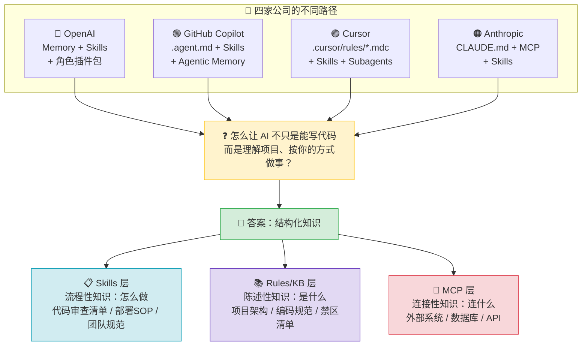
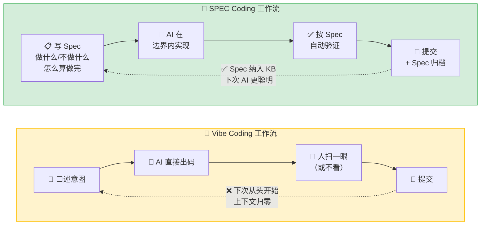
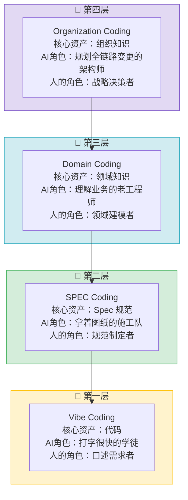
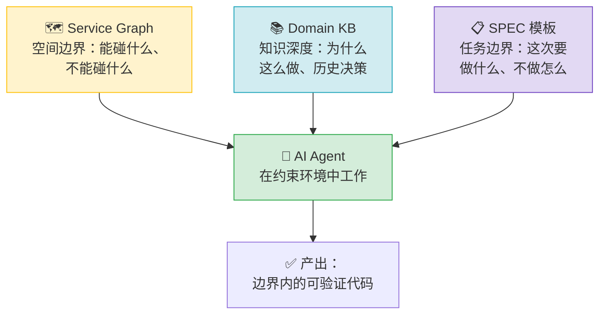
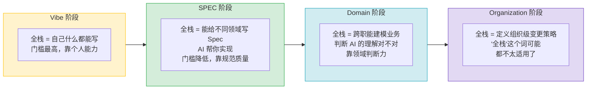
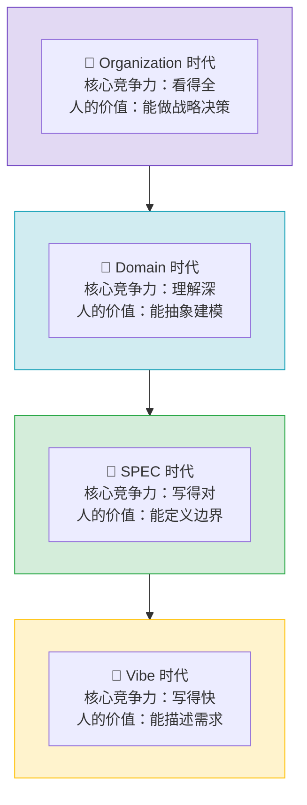

# AI 编程范式的范式转移：2026 年的一些学习和思考

> 预计篇幅：公众号长文（6000-8000字） | 状态：提纲 v4

---

## 文章定位

这不是一篇"指南"或"框架介绍"，而是一个后端程序员在 2026 年中对 AI 编程范式变化的**个人学习笔记**。素材来源：行业动态跟踪 + 与 AI 的对谈碰撞 + 自己的工作经验。

---

## 一、开场：我已经半年没怎么写代码了，但 AI 没有 🎬

**素材：** 南昌同学聚会，教培行业的朋友问我"AI 真的能写代码吗？"

展开两层：
- **圈外人的视角**：他们能接触到的 AI 是豆包、文心一言，Claude Code / Cursor / Copilot 这些工具他们没听过，也无法想象 AI 已经能独立完成多文件重构、跨服务改动
- **圈内人的处境**：我确实半年没怎么写代码了——不是失业了，而是 AI 在写，我的角色在变

引出核心问题：**当"写代码"这件事本身在贬值，程序员的价值锚点往哪里移？**

---

## 二、2026 年，AI Agent 生态的几个切片 —— 它们共同指向了什么 🔍

> 不是市场报告式的盘点，而是从四个切面观察"范式转移"的共同信号

### 2.1 OpenAI Codex：编码不再是开发者的专属技能
- 500 万周活，其中 20% 是非开发者（分析师、运营、产品），这个群体的增速是开发者的 3 倍
- Codex CLI 已经支持多 Agent 并行——一个 Agent 写前端，另一个 Agent 调后端，第三个 Agent 跑测试
- 关键信号：**"写代码"这个动作本身，正在从专业技能变成基础能力**

### 2.2 GitHub Copilot：企业级 Agent 架构已经不是一个"要不要用"的问题
- Copilot 桌面 App：多 Agent 仪表盘、隔离 Git Worktree、Agent 自动合入
- `.agent.md` 自定义 Agent + Skill 体系 + MCP Server 企业白名单
- 内置 sandbox（本地/云端），策略由企业统一管控
- 关键信号：**大厂已经把 Agent 纳入了工程治理体系——沙箱、权限、审计、合规，一个不少**

### 2.3 Anthropic 与 MCP：AI 工具的"USB-C 接口"已经确立
- MCP 2024 年底由 Anthropic 开源，2025 年底捐献给 Linux 基金会，OpenAI、Google、Microsoft、GitHub 全部加入
- 2026 年 3 月：月下载 9700 万次，公开 MCP Server 超过 17000 个
- Spotify、Amplitude、Block 等企业已深度集成
- 关键信号：**AI 连接外部系统这件事已经有了行业标准，不再是各家用各家的"方言"**

### 2.4 Cursor：规则驱动的编码模式已被工具层固化
- `.cursorrules` 已废弃，新的 `.cursor/rules/*.mdc` 支持四种激活模式
- Plan Mode（先出方案再执行）→ Agent Mode（多文件改动）→ Debug Mode（运行时排查）
- 反幻觉规则、接口冻结规则、防御性提交规则——这些不是"最佳实践建议"，是**写进工具的硬约束**
- 关键信号：**"先想清楚再让 AI 动手"，正在从人的自觉，变成工具的默认行为**

### 2.5 Skills：AI Agent 的"技能包"正在成为新标配

> MCP 解决"AI 能连什么"，Skills 解决"AI 该怎么做"

如果说 MCP 是 2025-2026 年最大的基础设施故事，那 **Skills 就是 2026 年最热的 Agent 应用层概念**。这四家公司，无一例外都在狂推：

| 公司 | Skills 的叫法 | 存放位置 | 核心特点 |
|------|-------------|---------|---------|
| **Anthropic** | Claude Code Skills | 项目内 `SKILL.md` | 渐进式加载（元数据 ~50 tokens → 按需加载完整指令），token 效率极高 |
| **OpenAI** | Codex Skills | 插件包内，跨 Codex/Claude Code 可移植 | 自然语言指令 + 预写脚本，减少幻觉和推理成本 |
| **GitHub** | Copilot Agent Skills | `.github/skills/` 或 `~/.copilot/skills/` | 社区共享（`awesome-copilot`），企业统一分发 |
| **Cursor** | Cursor Skills | `.cursor/skills/` | 自动发现 + 斜杠命令调用 + Skill 链式编排 |

**Skills 到底是什么？**

最好的类比：**Skills = 菜谱，MCP = 食材采购渠道，CLI = 厨房工具。**

- **菜谱（Skills）** 告诉你这道菜怎么做、分几步、什么时候加什么调料——这是**流程性知识**
- **食材采购（MCP）** 让你能买到新鲜的菜、肉、调料——这是**外部系统连接**
- **厨房工具（CLI/Rules）** 是刀、锅、炉子——这是**执行层**

一个成熟的 AI Agent 需要三者兼备。Skills 解决的核心问题是：**模型已经知道怎么做（训练数据里有），但不知道你团队的具体做法。** Skills 把"你们团队的 SOP"编码成 AI 能按需加载的指令包。

**为什么 Skills 在 2026 年集中爆发？**

三个原因：
1. **Token 经济账算过来了。** MCP 的问题是：连接 3 个外部 Server，Agent 还没动手就先吃掉 ~143K tokens（占 200K 上下文的 72%）。Skills 的渐进式加载只占 ~50 tokens 的索引量，需要时才展开全文。Arize 的评测显示，Skills 做同样任务的成本是 MCP 方案的 1/6，延迟是 1/5。
2. **可复用性被验证了。** 一个写得好的 Skill 可以跨项目、跨团队、甚至跨平台复用。Anthropic 的 Skills 格式已被 Cursor、Codex 等工具兼容。社区开始出现 Skill 集市。
3. **质量比连接更重要。** 2025 年大家忙着让 AI "能连上"各种系统（所以 MCP 爆发）。2026 年大家发现，"能连上"不等于"能做对"。真正拉开差距的，是 AI 执行任务时有没有靠谱的流程指导——这就是 Skills。

**Skills 和 MCP 不是替代关系，是互补关系：**

| 维度 | Skills | MCP |
|------|--------|-----|
| 解决的问题 | AI 不知道该怎么做 | AI 不知道该连什么 |
| 知识类型 | 流程性知识（SOP） | 连接性知识（API） |
| 加载方式 | 渐进式，按需展开 | 会话启动时全量加载 |
| Token 消耗 | ~50 tokens（索引），按需加载 | ~50K-150K tokens（全量工具定义） |
| 适用场景 | 团队规范、代码审查流程、部署清单 | 外部数据查询、第三方服务调用 |

> **一句话：MCP 让 AI 的手够得着，Skills 让 AI 的手知道往哪放。**

### 2.6 五个切面的交集：都在回答同一个问题

现在把五个信号放在一起看：

- OpenAI：Memory & Automations + Skills + 角色插件
- Copilot：`.agent.md` + Agentic Memory + Agent Skills + MCP 白名单
- Cursor：`.cursor/rules/*.mdc` + Skills + Subagents
- Anthropic：`CLAUDE.md` + MCP + Skills

> 每家都在回答同一个问题：**怎么让 AI 不只是"能写代码"，而是"能理解你的项目、按你的方式做事"？**

答案都指向同一个方向——**结构化知识。** 而落地形态已经收敛到三层架构：

```
┌─────────────────────────────────┐
│  Skills（流程性知识）             │  ← "怎么做"：代码审查清单、部署SOP、团队规范
├─────────────────────────────────┤
│  Rules / KB（陈述性知识）         │  ← "是什么"：项目架构、编码规范、禁区清单
├─────────────────────────────────┤
│  MCP（连接性知识）                │  ← "连什么"：外部系统、数据库、API
└─────────────────────────────────┘
```

在这一点上，四家公司的方向出奇一致。

### 🖼️ Mermaid 图 1：四家公司殊途同归，收敛到三层架构



---

## 三、Vibe Coding 与 SPEC Coding：不仅仅是两种工具用法，而是两种"人机关系" ⚔️

> 这是从 me.md 的核心论述展开，加入行业信号作为佐证

### 3.1 Vibe Coding：人在中心，AI 在外围
- 模式：人类凭直觉描述意图 → AI 生成代码 → 人类看一眼（或不看）→ 提交
- 核心假设：AI 的输出是可信的，或者至少 "跑起来再说"
- 适用于：原型验证、个人项目、一次性脚本
- 问题：**项目越大，Vibe Coding 的边际收益越低。**
  - 你每次跟 AI 对话，它对你的项目都是"第一次见面"
  - 口头约定、历史决策、禁区清单——这些不在代码里的东西，AI 猜不到
  - 一个人 Vibe 还行，三个人 Vibe 代码风格就开始割裂，十个人 Vibe 基本不可维护

### 3.2 SPEC Coding：规范在中心，AI 在边界内执行
- 模式：先写好 Spec（做什么、不做什么、怎么算做完）→ AI 在边界内实现 → 自动验证
- 核心假设：AI 的输出需要被**约束**和**验证**，信任但要兜底
- 适用于：生产级项目、多人协作、需要长期维护的系统
- 核心转变：**人的产出从"代码"变成了"规范"。代码只是规范的实现结果。**
- 行业正在发生的印证：
  - Cursor 的 Plan Mode 本质上就是"先出 Spec，后写代码"
  - Copilot 的 `.agent.md` 本质上是"把项目规范写在 AI 能看到的地方"
  - Claude Code 的 `CLAUDE.md` 同理——这不是写给人看的 README，是 Agent 的"入职手册"

### 🖼️ Mermaid 图 2：Vibe Coding vs SPEC Coding 工作流对比



### 3.3 一个类比：AI 是你的新同事，不是你肚子里的蛔虫

你在 me.md 里的"新人入职"类比非常精准——

> 设想一下你到一个陌生的环境，准备大干一场，你会怎么做？人生地不熟则要先熟悉地方、熟悉人，了解当地的习俗和规章制度。AI 也是如此。

Vibe Coding 的问题是：你每次都给新同事一个 30 秒的口头需求，然后让他直接上手改生产代码。

SPEC Coding 的做法是：先给新同事看员工手册、带他认路、告诉他哪些地方不能碰、哪些操作有风险——然后再给他分配任务。

**SPEC 的本质不是"限制 AI"，而是"让 AI 有足够的信息去做正确的事"。**

---

## 四、SPEC 之上还有什么？四阶段演进的视角 🔭

> 这里的四阶段模型不是"标准答案"，而是从 GPT 对谈中收获的一个思考框架，代表了其中一种审视未来的视角

### 4.1 四个阶段

| 阶段 | 核心资产 | AI 的角色 | 人的角色 |
|------|----------|----------|---------|
| Vibe Coding | 代码 | 打字很快的学徒 | 口述需求的人 |
| SPEC Coding | Spec 规范 | 拿着图纸的施工队 | 画图纸的人 |
| Domain Coding | 领域知识 | 理解业务的老工程师 | 定义领域边界的人 |
| Organization Coding | 组织知识 | 规划全链路变更的架构师 | 做战略决策的人 |

### 🖼️ Mermaid 图 3：四阶段演进金字塔



### 4.2 四个阶段之间的关系

- 不是四个"选一个"，而是四个"台阶"——每一层都依赖下一层
- 没有 Spec，就没有结构化的领域知识可以喂给 AI（Domain 的前提是 Spec）
- 没有 Domain，AI 就无法理解跨服务的业务含义（Organization 的前提是 Domain）
- 大部分团队现在卡在 Vibe → SPEC 的过渡期：不是不想往上走，是**知识还没来得及结构化**

### 4.3 Domain 和 Organization 不是科幻

一些早期信号已经在出现：
- Copilot 的 Agentic Memory 在尝试让 AI 跨会话记住仓库的特征——这是 Domain 的雏形
- Codex 的 Multi-agent v2 + 企业工作流编排——这是 Organization 的雏形
- MCP 的 17000+ 公开 Server 连接了 JIRA、GitLab、CI/CD、数据库——这是 AI 理解组织的基础设施

但也必须承认：**Domain Coding 和 Organization Coding 今天还只是"烟雾信号"，没有成熟的实践。** 所以接下来重点讨论的还是 SPEC——因为这个阶段是目前唯一可以着手做的。

---

## 五、SPEC Coding 落地，具体需要什么？🛠️

> 从你的 me.md 中"多服务 SPEC 落地"的讨论展开

### 5.1 Service Graph：让 AI 知道"改了这里，还会影响哪里"
- 微服务架构下，最危险的不是 AI 写错了代码，而是 AI 不知道这段代码影响了一个它压根不知道存在的服务
- Service Graph 不是新概念（服务网格、API 网关早就有），但它的新用途是：**作为 Agent 的上下文**
- 落地方向：注册中心 → 自动发现依赖 → 人工标注服务职责和风险等级 → 注入 Agent context

### 5.2 Domain KB：把游离在仓库之外的逻辑，搬进仓库里
- 这是你 me.md 里最核心的洞察之一——那些"口口相传的逻辑"
- KB 应该包含什么：
  - 架构概览（这个项目是什么、依赖谁、被谁依赖）
  - 编码范式（命名、目录结构、错误处理、事务边界）
  - 禁区清单（不能直接改的表、不能删的字段、不能动的配置项）
  - 历史决策（为什么当初选了 Kafka 而不是 RabbitMQ？为什么这个字段是 String 而不是 Int？）
  - CI/CD 触发条件（什么检查不过不能合入、什么标签触发什么流水线）
- 关键心态：**这些文档不是写给 AI 看的，是写给"未来的自己和新同事"看的。AI 只是顺带受益。**

### 5.3 SPEC 模板：让需求描述从"聊天记录"变成"可执行的契约"
- 问题：现在的需求描述方式——一段飞书消息、一张截图、一通电话
- 方案：一个最小化的 SPEC 模板，至少包含：
  - 功能描述（做什么）
  - 边界条件（不做什么，比做什么更重要）
  - 接口 / 数据模型变更
  - 验收标准
  - 影响范围（涉及哪些服务、哪些表）
- 价值：需求 → Spec → AI 实现 → 按 Spec 自动验证 → 形成闭环

### 🖼️ Mermaid 图 4：SPEC Coding 的三根支柱



三者加起来，AI 才能在一个有约束的、信息充分的环境下工作。

---

## 六、全栈工程师 2.0：角色在范式转移中的重定义 👨‍💻

> 从你 me.md 中后端 vs 前端的全栈讨论延伸

### 6.1 技术平权是真的，但不是对称的
- AI 确实降低了所有技术方向的门槛，但降低的幅度不一样
- 后端 + AI → 前端：所见即所得，改完立刻看到效果，迭代快
- 前端 + AI → 后端：业务逻辑藏得深，数据一致性、事务边界、并发问题——这些"看不见的东西"是真正的门槛
- 这不是"谁更难"，而是**风险不对称**：前端改坏了最多页面丑，后端改坏了数据丢了

### 6.2 全栈转型的前提不是"学技术"，而是"建知识"
- 你 me.md 里说的很清楚——不能一句话"大家以后都是全栈"，然后就落地了
- 后端写前端之前 → 需要前端仓库有清晰的组件规范、样式体系、设计 token 说明
- 前端写后端之前 → 需要后端仓库有清晰的领域模型、数据流向、事务边界说明
- **跨领域协作的前提是对方领域有 KB。没有 KB 的全栈转型，就是在赌。**

### 🖼️ Mermaid 图 5：不同阶段，"全栈"的含义完全不同



所以现在急着讨论"要不要做全栈"不如先讨论"KB 准备好了没有"。

---

## 七、回到最初的问题：程序员的价值锚点往哪里移？💡

> 收束全文，回到开场的那个问题

### 7.1 AI 能做的事情清单（2026 年版）
- ✅ 根据描述生成代码（已经很强）
- ✅ 跨文件重构（2025-2026 年进步显著）
- ✅ 写测试、写文档、写 CI 配置
- ⚠️ 理解复杂的跨服务业务逻辑（在进步，但需要 KB）
- ❌ 替你做决策（它没有担责的能力）

### 7.2 人不应该跟 AI 卷"谁能更快写出代码"
- 你半年没写代码，AI 每分钟能生成上千行——如果"写代码"是核心竞争力，那人已经输了
- 但"写出对的代码"和"写出代码"是两回事

### 🖼️ Mermaid 图 6：人的价值锚点在持续上移



### 7.3 最核心的一个判断

> **在 Vibe 时代，核心竞争力是"写得快"。在 SPEC 时代，核心竞争力是"写得对"。在 Domain/Organization 时代，核心竞争力是——知道什么不能做、知道边界在哪、知道一个需求到底牵动了什么。**

而这些"知道"，不是靠聪明，是靠知识被结构化地记录下来。

**未来几年，团队之间最大的差距，可能不是谁用了更强的 AI 模型，而是谁先把散落在人脑里的隐性知识，变成了 AI 能读懂的、可迭代的、有边界的结构化文档。**

---

## 八、展望：一年后（2027 年中），AI Agent 会以什么形式落地？🔮

> 基于当前轨迹的推演，不是预言，是"如果这些趋势继续，大概率会看到什么"

### 8.1 几乎可以确定的（概率 >80%）

**① "Spec-first" 成为严肃团队的主流范式**
- AGENTS.md / CLAUDE.md / .cursor/rules 像今天的 README.md 一样成为仓库标配
- 新项目从 init 开始就带着 Agent 规则文件，而不是后来补
- 团队 Code Review 清单里多了一条："Agent 能看懂这个改动吗？要不要更新 KB？"

**② Skills + MCP 双层生态成型**
- 公开 MCP Server 突破 5 万+，公开 Skill 包突破 1 万+
- 出现"组织级 Skill 市场"：企业内部平台团队维护一套官方 Skill 集（代码审查 Skill、部署检查 Skill、安全扫描 Skill），全公司 Agent 自动加载
- "接 MCP" 和今天"接 API"一样自然；"装 Skill" 和今天"装 VS Code 插件"一样简单
- Skills 和 MCP 的分工被行业广泛接受：Skills 管"怎么做"，MCP 管"连什么"

**③ 企业级 Agent 治理框架成熟**
- 至少一家大厂开源自己的 Agent 治理方案（类似 Google 开源 Kubernetes 的剧本）
- Sandbox 策略、权限模型、审计日志——这三个成为企业 Agent 平台的标配
- "Agent 操作审批流" 出现在至少一个主流代码托管平台

**④ Agent 代码在总产出中的占比持续攀升**
- 头部团队（如 Spotify、NVIDIA）公开表示 30-50% 的 PR 由 AI 独立完成
- 非开发者通过 Agent 提交代码不再是新闻，而是常态
- "AI-authored commit" 成为 git history 中的常见标签

### 8.2 很有可能的（概率 50-80%）

**⑤ 出现第一批"Spec 工程师"或"Agent Enablement Engineer"岗位**
- 核心职责：写高质量 Spec、建 Domain KB、维护 Service Graph、编写和维护团队 Skill 集
- 核心技能不是"会写代码"，而是"能把业务逻辑和团队规范讲清楚"
- 这个岗位可能叫 "Agent Enablement Engineer" 或 "AI Onboarding Specialist"
- Skills 的编写和维护变成一项独立的专业能力，而不是"顺便写写"

**⑥ 多 Agent 协作从实验走向生产**
- 不是"一个 Agent 干所有事"，而是"三个 Agent 各司其职"：
  - Spec Agent：把需求转化为结构化 Spec
  - Coding Agent：按 Spec 实现代码
  - Review Agent：按 Spec + 禁区规则做第一轮 Code Review
- 多个 Agent 之间通过 MCP 共享上下文

**⑦ 第一次"AI Agent 导致的重大生产事故"引发行业讨论**
- 不是 AI 代码有 bug（这种一直都有），而是 Agent 跨服务改动了不该动的逻辑，而没人发现
- 倒逼行业形成共识：**Agent 的"权限范围"必须显式定义，不能默认"能读就能改"**

### 8.3 可能但不确定的（概率 30-50%）

**⑧ Domain Coding 的早期实践出现**
- 至少一家公司（大概率是 Spotify 或 Block 这种已经深度投入 MCP 的）公开分享他们如何让 AI "理解业务"
- 形式可能是：领域事件图谱 + 业务规则引擎 + Agent 上下文注入
- 还不会成为主流，但会引发大量讨论和模仿

**⑨ "Agent-native" 的编程语言或框架出现**
- 一种语言/框架，从设计之初就假设"代码主要是 AI 写的，人是 Spec 的制定者和验证者"
- Spec 和代码的一体化——不再是分离的文档和代码，而是 Spec 层和实现层的紧耦合
- 类似当年 TypeScript 对 JavaScript 的"类型约束"升级，这次是"Spec 约束"升级

**⑩ 团队的"AI 采纳度"开始被量化评估**
- 类似当年的"DevOps 成熟度模型"，出现"AI 开发成熟度模型"
- 评估维度可能包括：KB 覆盖率、Spec 驱动比例、Agent 产出占比、Agent 事故率
- 管理层开始用这些指标来考核团队的"技术先进性"

### 8.4 最不确定但最值得关注的一件事

> **当 Agent 能独立完成 50% 以上的日常开发工作时，"软件开发团队"的最小规模会变成多大？**

- 今天一个典型的 Scrum 团队可能是 5-7 个开发 + 1 个 PM + 1 个 QA
- 如果 AI 承担了 50% 的编码工作，这个团队是变成 3 个开发 + 1 个 Spec 工程师，还是变成 5 个开发但产出翻倍？
- 这个问题在 2027 年不会有标准答案，但一定会有先锋团队交出他们的答卷

---

## 附录：参考资料

- OpenAI Codex (2026 Gartner 领导者, 500万+周活)
- GitHub Copilot Build 2026 发布 (Copilot App, Sandboxes, Autopilots)
- Anthropic Code w/ Claude London 2026
- MCP 协议 Linux Foundation 2026 (月下载9700万, 17000+公开Server)
- Cursor 0.45+ Rules 体系 (.cursor/rules/*.mdc)
- GPT 对谈中提出的四阶段演进模型
- 个人经历：南昌同学聚会、半年未写代码的开发体验
