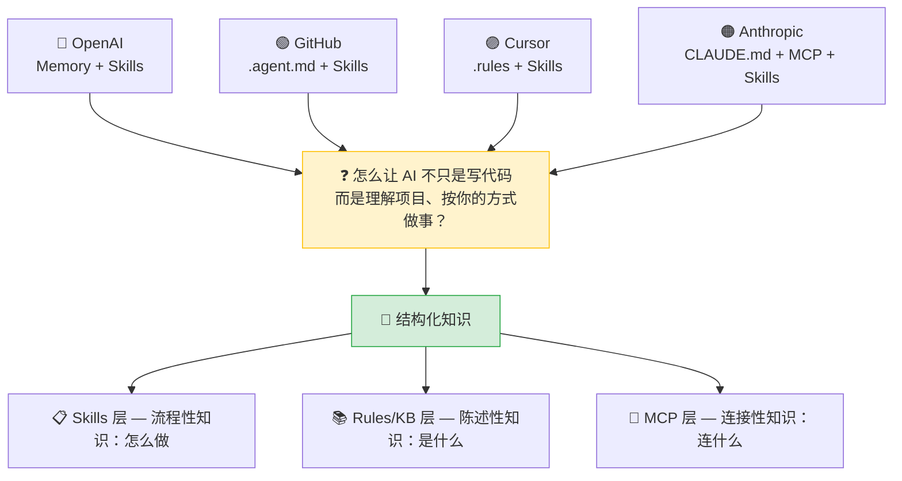
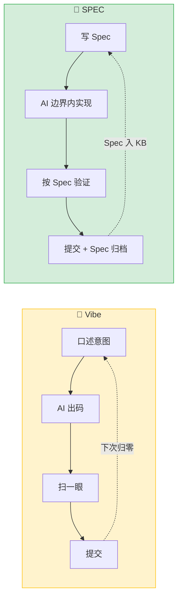
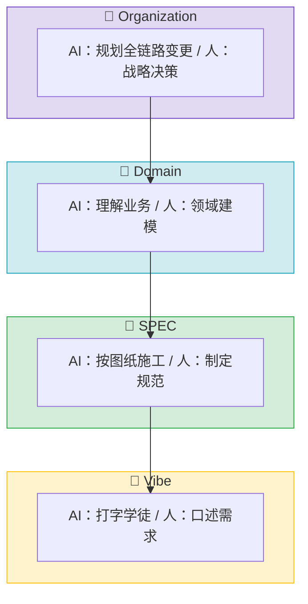
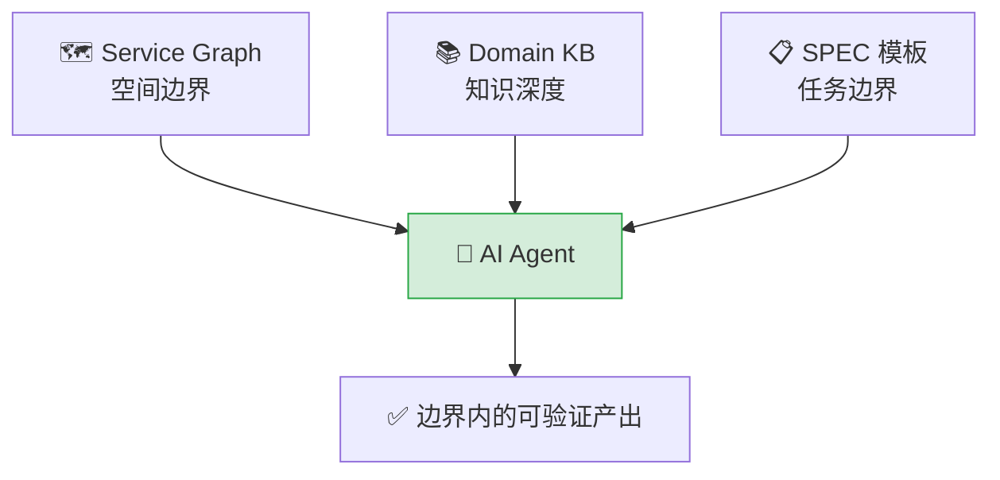
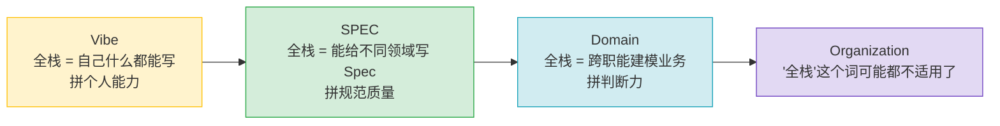
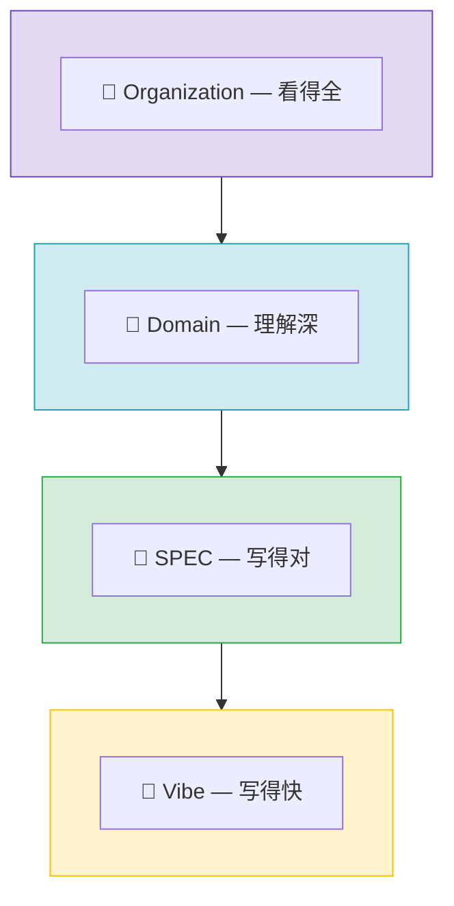

# AI 编程范式正在转移：一些笔记

今年 4 月回南昌，一个做教培的老同学问我："AI 真的能写代码吗？" 他眼里的 AI 是豆包和文心一言。他没听过 Claude Code，不知道 Cursor 能跨文件重构、自动跑测试、自己提 PR。

而我已经半年多没怎么写代码了。不是失业，是 AI 在写。

这篇文章是我对 2026 年 AI 编程范式变化的个人梳理。不是指南，不是预言，是一份思考笔记。

---

## 一、五个信号，一个方向

**OpenAI Codex**：500 万周活，20% 是非开发者，增速是开发者的 3 倍。"写代码"正在从专业技能降级为基础能力。

**GitHub Copilot**：桌面 App 已是多 Agent 控制中心——隔离 Git Worktree、沙箱执行、CI 通过后自动合入。企业级 Agent 治理不是实验，是基础设施。

**MCP 协议**：月下载 9700 万次，17000+ 公开 Server，Linux 基金会托管。AI 连接外部系统有了"USB-C 标准"。

**Cursor**：`.cursorrules` 被 `.cursor/rules/*.mdc` 取代。Plan → Agent → Debug 三阶段分离。"先想清楚再动手"从人的自觉变成了工具的内置行为。

**Skills**：四家公司同时在推。Skills 解决的是"怎么做"——把团队的 SOP 编码成 AI 能按需加载的指令包。和 MCP 互补：MCP 让手够得着，Skills 让手知道往哪放。

五件事指向同一个结论：

---

## 二、Vibe Coding vs SPEC Coding

这是两个底层范式，不是两种工具用法。

**Vibe Coding**：人凭直觉描述意图，AI 出代码，人扫一眼提交。项目越大边际收益越低——每次对话 AI 都对你的项目是"第一次见面"，口头约定和历史决策它猜不到。一个人还行，三个人风格割裂，十个人不可维护。

**SPEC Coding**：先写 Spec（做什么、不做什么、怎么算做完），AI 在边界内实现，按 Spec 验证。人的直接产出从代码变成了规范——代码只是规范的实现。

最好的类比：AI 是新同事，不是你肚子里的蛔虫。Vibe 的做法是每次给他 30 秒口头需求，让他直接改生产代码。SPEC 的做法是先给他看员工手册、带他认路、标出禁区——再派任务。

**SPEC 不是限制 AI，而是给 AI 足够信息去做正确的事。** 没有信息的新人不叫自由，叫盲目。

---

## 三、SPEC 之上还有什么

一次对谈中 AI 给出了一个四阶段框架：

| 阶段 | 核心资产 | AI 角色 | 人的角色 |
|------|----------|--------|---------|
| Vibe | 代码 | 打字快的学徒 | 口述需求 |
| SPEC | Spec | 拿图纸的施工队 | 画图纸 |
| Domain | 领域知识 | 懂业务的老工程师 | 定义边界 |
| Organization | 组织知识 | 规划全链路的架构师 | 做决策 |

四个阶段是台阶，不是选项。越往上，核心资产离代码越远，离知识越近。

坦率讲，Domain 和 Organization 今天只是烟雾信号。大部分团队卡在 Vibe → SPEC 的楼梯上——不是不想往上走，是知识还没来得及结构化。

---

## 四、SPEC 落地的三件东西

**Service Graph**。微服务架构下，最危险的不是 AI 写错代码，而是它不知道改的这段代码影响了一个它不知其存在的服务。注册中心自动发现 + 人工标注风险等级 → 注入 Agent 上下文。

**Domain KB**。游离在仓库之外的逻辑——口头约定、历史决策、禁区清单——AI 猜不到。至少需要架构概览、编码范式、禁区清单、历史决策记录、CI 门禁说明。心态要对：**这些文档不是写给 AI 的，是写给未来的自己和新同事的。AI 顺带受益。**

**SPEC 模板**。飞书消息和截图不是需求描述。最小化的 Spec：做什么、不做什么（比做什么更重要）、接口/数据模型变更、验收标准、影响范围。

三者关系：Service Graph 管"能碰什么"，Domain KB 管"为什么"，SPEC 模板管"这次做什么"。

---

## 五、全栈工程师重定义

AI 降低了所有技术方向的门槛，但降幅不等。后端 + AI → 前端，相对顺畅，所见即所得。前端 + AI → 后端，挑战更大——数据一致性、事务边界、并发问题藏在暗处。不是能力歧视，是风险不对称：前端改坏最多丑，后端改坏数据丢。

全栈转型的前提不是学技术，是建知识。后端写前端之前，前端仓库得有组件规范。前端写后端之前，后端仓库得有领域模型和禁区清单。**没有 KB 的全栈转型，是在赌。**

从四阶段看"全栈"的含义变化：

所以现在与其讨论"要不要全栈"，不如先问：KB 准备好了没有？

---

## 六、价值锚点往哪里移

AI 每分钟能生成上千行代码。人跟 AI 卷速度，在 2026 年已经没有意义。但"写出代码"和"写出对的代码"是两回事——后者需要知道改了什么影响、有没有碰禁区、异常路径兜底了吗、数据一致性有无保证。这些东西不在代码里，在人脑里。

**在 Vibe 时代，拼的是写得快。在 SPEC 时代，拼的是写得对。在 Domain/Organization 时代，拼的是知道什么不能做、知道边界在哪、知道一个改动到底牵动了什么。**

这些事情没有一样靠聪明。全靠在知识被结构化地记录下来。

未来几年，团队之间最大的差距，不是谁用了更强的模型，而是谁先把散落在人脑里的隐性知识变成了 AI 能读懂的、可迭代的、有边界约束的结构化文档。

技术平权降低了编码门槛，但拉高了判断力的门槛。AI 能写 90% 代码之后，剩下那 10%——边界在哪、什么不能做、出问题往哪看——才是人的护城河。

---

## 七、一年后

以下不是预言，是趋势推演。

**几乎确定：** Spec-first 成为主流范式，AGENTS.md 像 README.md 一样成为仓库标配。MCP Server 破 5 万，Skill 包破 1 万。至少一家大厂开源 Agent 治理方案。头部团队 30-50% 的 PR 由 AI 独立完成。

**很有可能：** 出现"Agent Enablement Engineer"岗位——核心技能不是写代码，是把业务逻辑讲清楚。多 Agent 协作进入生产（一个出 Spec、一个写代码、一个做首轮 Review）。至少一次重大 Agent 生产事故倒逼行业形成权限显式定义的共识。

**可能但不一定：** Spotify 或 Block 公开 Domain Coding 实践。出现 Agent-native 的编程框架——Spec 和代码的紧耦合，类似 TypeScript 给 JavaScript 加上的那层类型约束。

**最值得追问的：** 当 50% 代码是 AI 写的，最小团队规模会变成多少？3 个开发 + 1 个 Spec 工程师，还是 5 个开发但产出翻倍？2027 年不会有标准答案，但先锋团队会交出答卷。

而那些还在问"AI 真的能写代码吗？"的人，可能已经不在牌桌上了。

---

*这篇文章的很多观点不是写之前就想好的，是在写的过程中被追问、补充、挑战后逐渐清晰的。写作本身就是思考。*
