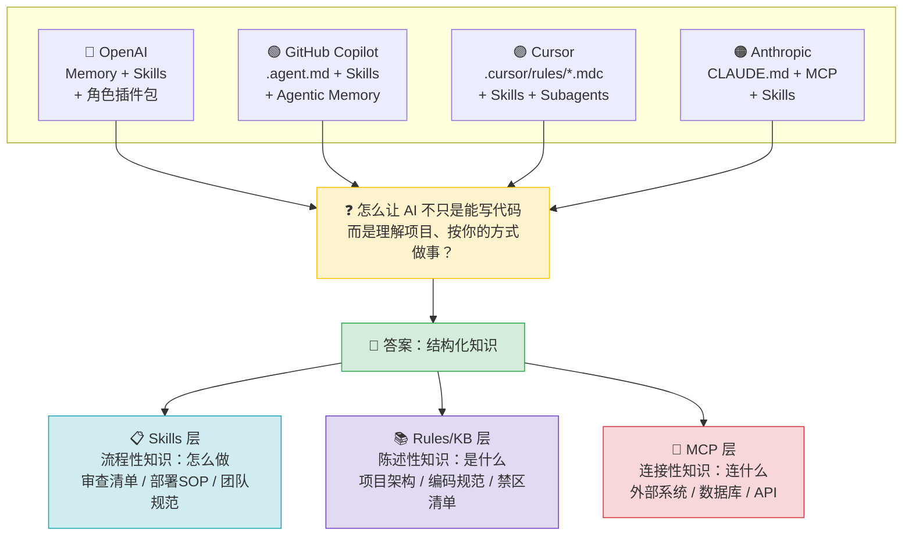
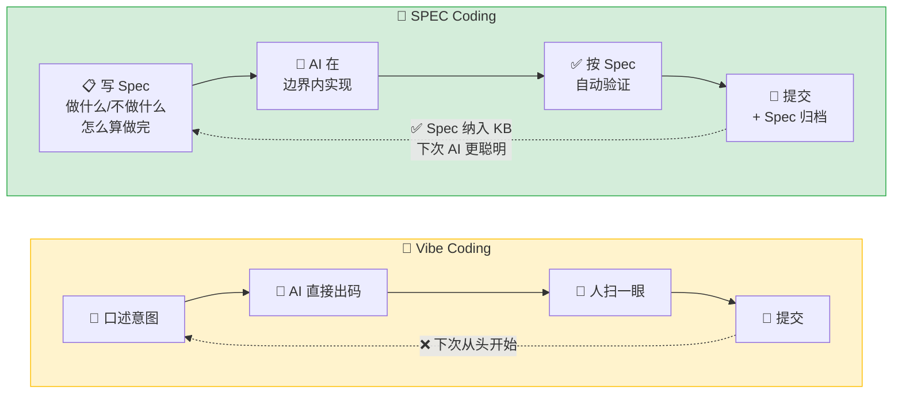
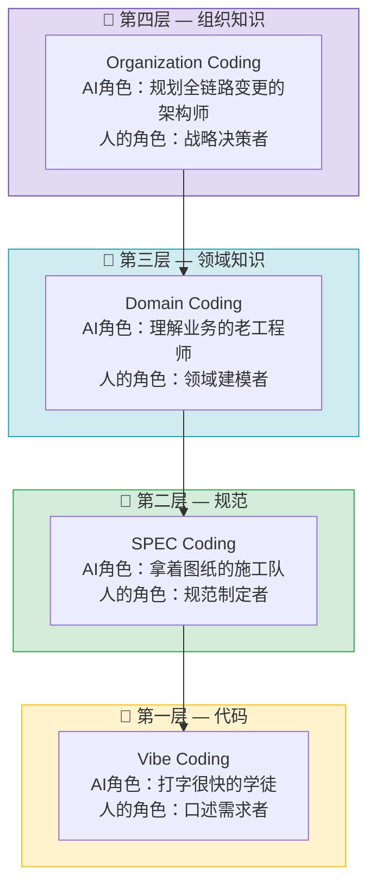
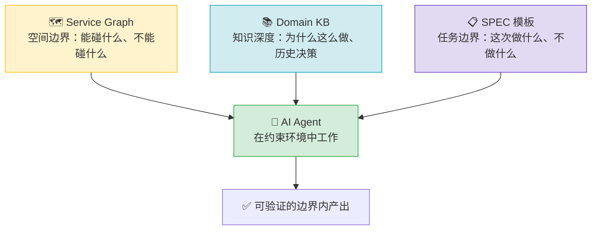
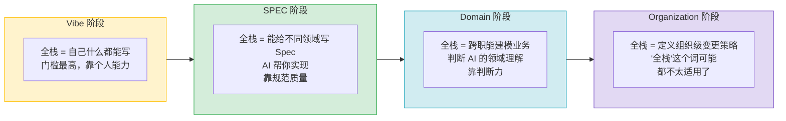
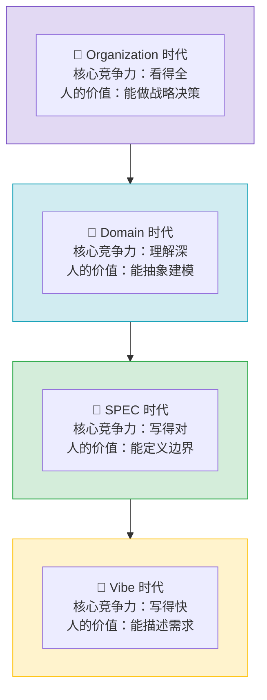

# AI 编程范式的范式转移：2026 年的一些学习和思考

## 一、我已经半年没怎么写代码了，但 AI 没有

今年 4 月底回南昌，跟几个老同学聚会。其中一个在教培行业干了七八年的朋友，听说我最近半年多没怎么写过代码，眼睛瞪得很大："AI 真的能写得了代码吗？"

他问得很真诚。在他的世界里，能接触到的 AI 就是豆包、文心一言这些国产大模型——它们能聊天、能写周报、能生成图片，但"独立完成编程工作"这件事，超出了他的认知边界。他没用过 Cursor，没听过 Claude Code，更想象不出一个 AI 终端工具能跨多个文件做重构、自动跑测试、自己修 bug、然后把 PR 提上去。

但坐在他对面的我，确实半年没怎么写过代码了。不是因为失业，而是 AI 在写——我的角色正在变。

这不是一篇鼓吹 AI 万能、或者渲染程序员焦虑的文章。我想认真梳理一下 2026 年正在发生的这些变化：AI 编程的范式到底在往哪走？对我们这些写代码的人来说，价值锚点往哪里移？以及，接下来的 12 个月，可能会发生什么。

---

## 二、2026 年，AI Agent 生态的五个切片

先把镜头拉远，看看 2026 年上半年几个关键玩家各自在干什么。不是为了做市场报告，而是从中找出几条共同的暗线。

### 2.1 OpenAI Codex：编码不再是开发者的专属技能

Codex 现在有 500 万周活用户。最值得关注的数据不是这个总量，而是结构：**其中 20% 是非开发者——分析师、运营、产品经理——这个群体的增速是开发者的 3 倍。**

OpenAI 在 6 月初刚办了一场叫"Intelligence at Work"的发布会，一次性推出了 6 个角色专属插件包，覆盖数据分析（接 Snowflake、Tableau）、创意生产（接 Figma、Canva）、销售（接 Salesforce、HubSpot）、甚至投行尽调（接 Moody's、PitchBook）。62 个企业应用 + 110 个自动化技能，直接打包进 Codex。

这背后的逻辑很清楚：**"写代码"这个动作本身，正在从一项专业技能变成一种基础能力。** 当非开发者用 AI 干活的速度比开发者还快 3 倍时，说明这个技能的门槛已经被踏平了。

### 2.2 GitHub Copilot：企业级 Agent 架构已经不是"要不要用"的问题

微软在 2026 年 Build 大会上发布的 Copilot 桌面 App 是一个很重要的信号。它不再是一个 IDE 插件，而是一个**多 Agent 控制中心**——你能在一个仪表盘上同时看到三个 Agent 分别在不同的 Git Worktree 里工作，各自跑自己的沙箱，CI 通过后自动合入。整个过程中，Agent 之间的文件系统互相隔离，权限由企业统一管控。

更关键的是 Copilot SDK 的发布（支持 Node.js、Python、Go、.NET、Rust、Java）。这意味着企业可以用同一套 Agent 运行时来构建自己的内部开发工具——不只是一个"帮你写代码"的助手，而是一个嵌入到整个软件交付流程里的编排层。

**大厂已经把 Agent 纳入了工程治理体系：沙箱、权限、审计、合规，一个不少。** 这意味着这不是实验项目，而是基础设施级别的投入。

### 2.3 Anthropic 与 MCP：AI 连接外部系统的"USB-C 标准"确立

Model Context Protocol（MCP）是一个很有意思的故事。2024 年底 Anthropic 开源了它，到 2025 年底已经捐献给 Linux 基金会，OpenAI、Google、Microsoft、GitHub 全部加入成为创始成员。2026 年 3 月的数据：月下载 9700 万次，公开 MCP Server 超过 17000 个。

这意味着什么？**以前每家 AI 工具连接外部系统用的是各家的"方言"——Claude Code 的插件是一种格式，Codex 的插件是另一种。现在 MCP 统一了这件事。** 一个 MCP Server 写出来，Claude Code 能用、Cursor 能用、Codex 也能用。这就是 AI 时代的"USB-C 接口"。

Spotify、Amplitude、Block（Square/Cash App）已经在生产环境深度集成了 MCP。Block 的公开数据是：员工每天通过 MCP 连接的 Agent 节省了 50-75% 的时间。

### 2.4 Cursor：规则驱动的编码模式已被工具层固化

Cursor 在 2025-2026 年的演进路线很说明问题。旧的 `.cursorrules` 单文件被废弃了，取而代之的是 `.cursor/rules/*.mdc` 分层规则体系——支持四种激活模式（始终应用、按文件类型触发、Agent 智能判断、手动引用）。这当然不是把 `.cursorrules` 拆成多个文件这么简单，本质上是把"怎么约束 AI 的行为"变成了一套结构化的、可组合的、可共享的体系。

另外 Cursor 的 Plan Mode → Agent Mode → Debug Mode 三阶段分离也值得关注。"先想清楚再让 AI 动手"这个流程，已经从人的自觉变成了工具的内置行为。反幻觉规则、接口冻结规则、防御性提交规则——这些不是"最佳实践建议"，是写进工具的硬约束。

### 2.5 Skills：各家都在推的"技能包"

如果 MCP 是 2025 年的主角，那 **Skills 就是 2026 年最热的应用层概念**。四家公司无一例外都在狂推：

| 公司 | Skills 形态 | 核心思路 |
|------|------------|---------|
| **Anthropic** | `SKILL.md` 文件，渐进式加载 | 元数据 ~50 tokens 索引，需要时才展开全文 |
| **OpenAI** | 角色插件内的 Skill，跨平台可移植 | 自然语言指令 + 预写脚本，减少幻觉 |
| **GitHub** | `.github/skills/` + 社区共享 | 企业统一分发，Copilot 自动发现并加载 |
| **Cursor** | `.cursor/skills/` + Skill 链式编排 | 自动发现 + 自定义管道 |

Skills 解决的核心问题是：AI 模型已经知道"怎么写代码"（训练数据里有），但它不知道**你们团队**怎么写。Skills 把团队特定的 SOP——比如"我们怎么审查代码"、"部署前必须检查什么"、"这个仓库的 commit 格式规范"——编码成 AI 可以按需加载的指令包。

**Skills 和 MCP 不是竞争关系，而是互补关系：MCP 让 AI 的手够得着外部系统，Skills 让 AI 的手知道往哪放。** 一个好的类比：Skills 是菜谱（告诉你怎么做），MCP 是食材采购渠道（让你买到原材料），CLI 和 Rules 是厨房工具（实际的执行层）。

Arize 在 2026 年 5 月做了一组对比评测：同一个 GitHub 任务，分别用纯 MCP 方案和纯 Skills 方案执行。结论是双方最终的正确率差不多，但 **Skills 的成本是 MCP 的 1/6，延迟是 1/5**。原因很简单：MCP 在会话启动时会把所有工具定义全量加载（3 个 Server 就吃掉 ~143K tokens，占 200K 上下文的 72%），而 Skills 采用渐进式加载，只有在 agent 判断"这个任务需要用到这个技能"时才加载完整指令。

### 2.6 五个切面的交集

把五件事放在一起看，有一个非常清晰的收敛方向：

> **每家都在回答同一个问题：怎么让 AI 不只是"能写代码"，而是"能理解你的项目、按你的方式做事"？**

答案都指向同一个方向——**结构化知识**。而落地形态已经收敛到一个三层架构：

---

## 三、Vibe Coding 与 SPEC Coding：不仅仅是两种工具用法

如果说第二章是观察行业"现在在发生什么"，那这一章我想聊聊两个范式背后的底层差异。

### 3.1 Vibe Coding：人在中心，AI 在外围

Vibe Coding 的模式很简单：人凭直觉描述意图 → AI 生成代码 → 人扫一眼（有时候不看）→ 提交。核心假设是 AI 的输出基本可信，或者至少"跑起来再说"。

这个模式在原型验证、个人项目、一次性脚本这种场景下非常高效。但项目越大，它的边际收益越低。原因有三：

第一，你每次跟 AI 对话，它对项目都是"第一次见面"。上一次对话里你告诉它的上下文、偏好、约定，在这一次对话里都不存在。

第二，不在代码里的东西——口头约定、历史决策、禁区清单——AI 绝对猜不到。你说"改一下订单状态流转"，AI 不知道你们团队三个月前刚踩过一个坑：订单状态从"已支付"到"已发货"中间必须经过风控校验。这件事在代码里看不出来，但线上出过一次事故之后每个人都知道。AI 不知道。

第三，一个人 Vibe 还行，三个人的代码风格就开始割裂，十个人的项目基本不可维护。因为每个人跟 AI 对话的方式不同、prompt 的颗粒度不同、对输出质量的要求也不同。

### 3.2 SPEC Coding：规范在中心，AI 在边界内执行

SPEC Coding 的模式是反过来的：先写 Spec——做什么、不做什么、怎么算做完——然后 AI 在 Spec 划定的边界内实现，最后按 Spec 自动验证。

核心转变在于：**人的直接产出从"代码"变成了"规范"。代码只是规范的一个实现结果。**

这在 2026 年已经不是纯理论了。Cursor 的 Plan Mode 本质上就是"先出 Spec，后写代码"——Plan 阶段 AI 只出方案，不写代码；Agent 阶段才动手执行。GitHub Copilot 的 `.agent.md` 本质上就是把项目规范写在一个 AI 能读到的地方。Claude Code 的 `CLAUDE.md` 同理——这不是写给人看的 README，是 Agent 的"入职手册"。

### 🖼️ 两种范式的对比

### 3.3 AI 是你的新同事，不是你肚子里的蛔虫

我在之前的一篇笔记里写过这么一个类比：

> 设想一下你到一个陌生的环境，准备大干一场。人生地不熟，你得先熟悉地方、熟悉人、了解当地的习俗和规章制度。AI 也是一样的。

Vibe Coding 的做法是：你每次都给新同事一个 30 秒的口头需求，然后让他直接上手改生产代码。不出错才怪。

SPEC Coding 的做法是：先给新同事看员工手册、带他认路、告诉他哪些地方不能碰、哪些操作有风险——然后再给他分配任务。不仅出错率低，而且他越做越熟练，因为你每次都把经验沉淀下来了。

**SPEC 的本质不是"限制 AI"，而是"让 AI 有足够的信息去做正确的事"。** 一个没有信息的新人不是自由的——他是盲目的。

---

## 四、SPEC 之上还有什么？

有一次跟 AI 对谈，对方给出了一个很有意思的思考框架，把 AI 编程范式的演进分成了四个阶段：

| 阶段 | 核心资产 | AI 的角色 | 人的角色 |
|------|----------|----------|---------|
| Vibe Coding | 代码 | 打字很快的学徒 | 口述需求的人 |
| SPEC Coding | Spec 规范 | 拿着图纸的施工队 | 画图纸的人 |
| Domain Coding | 领域知识 | 理解业务的老工程师 | 定义领域边界的人 |
| Organization Coding | 组织知识 | 规划全链路变更的架构师 | 做战略决策的人 |

这个模型的价值不在"精准预测"，而在它给出了一条清晰的资产迁移路径：**越往上，核心资产离"代码"越远，离"知识"越近。**

四个阶段不是四选一，而是四个台阶。每一层都依赖下一层：没有 Spec 就没有结构化的领域知识可以喂给 AI；没有 Domain 知识，AI 就无法理解跨服务的业务含义，更谈不上规划全链路变更。

坦率地说，Domain Coding 和 Organization Coding 在今天还只是"烟雾信号"——有迹象，无成熟实践。但信号确实存在：Copilot 的 Agentic Memory 在尝试让 AI 跨会话记住仓库特征（Domain 的雏形），Codex 的 Multi-agent v2 + 企业工作流编排在做全链路任务规划（Organization 的雏形），17000+ MCP Server 正在把企业的各种系统连接成一张可被 AI 读取的网。

但今天大部分团队的真实处境是：卡在 Vibe → SPEC 的过渡带上。不是不想往上走，是知识还没来得及结构化。

---

## 五、SPEC Coding 落地，具体需要什么？

聊完了"是什么"和"往哪走"，这一章聊"怎么干"。如果想在团队里把 SPEC Coding 跑起来，需要三样东西。

### 5.1 Service Graph：让 AI 知道"改了这里，还会影响哪里"

微服务架构下最危险的事不是 AI 写错了代码，而是 AI 改了一段代码，但完全不知道这段代码影响了一个它压根不知道存在的服务。Service Graph 本身不是新概念——服务网格、API 网关、注册中心早就有了。但它的新用途值得单独提出来：**作为 Agent 的上下文注入。**

想象一下，当你让 AI 改订单服务的某个接口时，它的上下文里自动带上了"这个接口被支付服务、物流服务、通知服务调用，其中支付服务是 P0 级别，修改涉及金额计算逻辑时必须由人工确认"。这跟"AI 只看到一个订单服务仓库"的差别，是信息量级的差别。

落地方向很清晰：注册中心做自动发现 → 人工标注服务职责和风险等级 → 在 Agent 启动时把相关子图注入上下文。不需要一开始就完美，先有一张能用的图。

### 5.2 Domain KB：把游离在仓库之外的逻辑，搬进仓库里

团队里总有那么一些知识，不在代码里，不在文档里，只在人脑里——口头约定的错误处理方式、某次线上事故后定下的禁区规则、三年前选型时为什么挑了 Kafka 而不是 RabbitMQ 的来龙去脉。

这些知识在 AI 时代之前就已经是问题（新人入职成本高、bus factor 低），但 AI 时代让问题的代价变高了：以前新人来了慢慢熟悉就好，现在 AI 明天就要替你改代码，而它对这一切一无所知。

一个最小化的 Domain KB 至少应该包含：

- **架构概览**：这个项目是什么、依赖谁、被谁依赖
- **编码范式**：命名约定、目录结构、错误处理模式、事务边界
- **禁区清单**：不能直接改的表、不能删的字段、不能动的配置项——这个比什么都重要
- **历史决策记录**：为什么当时选了 A 而不是 B？那个"看起来很蠢"的设计其实有一个历史原因
- **CI/CD 门禁**：什么检查不过不能合入、什么标签触发什么流水线

最重要的心态是：**这些文档不是写给 AI 看的，是写给"未来的自己和新同事"看的。AI 只是顺带受益。** 今天你把一个历史决策写下来，可能只是记录；三个月后 AI 对着你的代码准备"优化"掉那个看起来很蠢的 if-else 时，你的记录救了你的线上服务一命。

### 5.3 SPEC 模板：让需求描述从"聊天记录"变成"可执行的契约"

很多团队现在的需求描述方式是这样的：一段飞书消息、一张截图、一通 5 分钟的电话。然后你拿着这些去跟 AI 说"帮我实现一下"。

SPEC 模板要做的就是把这件事正规化。一个最小化的 SPEC 至少包含：

- 功能描述（做什么）
- 边界条件（不做什么——这个比"做什么"更重要）
- 接口 / 数据模型变更
- 验收标准（怎么算做完）
- 影响范围（涉及哪些服务、哪些表）

有了这个，需求 → Spec → AI 实现 → 按 Spec 自动验证 → 形成闭环。而且 Spec 本身变成了可复用的资产：下次类似的需求，把上次的 Spec 改一改就能用。

### 🖼️ 三根支柱的关系

Service Graph 告诉你"能碰什么、不能碰什么"——这是空间边界。Domain KB 告诉你"为什么这么做"——这是知识深度。SPEC 模板告诉你"这次要做什么"——这是单次任务的边界约束。三者加起来，AI 才是在一个有约束的、信息充分的环境下工作，而不是在一片黑暗里靠 prompt 摸爬滚打。

---

## 六、全栈工程师 2.0：角色在范式转移中的重定义

### 6.1 技术平权是真的，但不是对称的

AI 确实降低了所有技术方向的门槛，但降低的幅度不是均匀的。作为一个后端程序员，我的体感是：**后端 + AI → 前端，相对顺畅；前端 + AI → 后端，挑战更大。**

这不是能力歧视。前端所见即所得，改完立刻看到效果，迭代快、反馈短。后端的业务逻辑藏得深——数据一致性、事务边界、并发问题、异常情况的兜底——这些"看不见的东西"才是真正的门槛。前端改坏了最多页面丑，后端改坏了数据丢了。风险不对称。

去年阿里传出的"后端转全栈"其实是一个信号：大厂已经意识到，AI 时代"全栈"这件事需要重新定义。

### 6.2 全栈转型的前提不是"学技术"，而是"建知识"

不能一句话"以后大家都是全栈"，然后就指望它丝滑落地。

后端写前端之前，至少需要前端仓库有清晰的组件规范、设计 token 说明、样式体系、状态管理范式。前端写后端之前，至少需要后端仓库有清晰的领域模型、数据流向、事务边界说明、禁区清单。

**跨领域协作的前提是对方领域的 KB。没有 KB 的全栈转型，就是在赌。** 你赌 AI 能自己猜出来对方领域的约定和陷阱，但 AI 猜不出来——代码里没有的东西，AI 看不到。

### 6.3 "全栈"在四个阶段的含义完全不同

在 Vibe 阶段，全栈的意思是"我自己什么都能写"，门槛最高，拼的是个人技术广度。

在 SPEC 阶段，全栈变成了"我能给不同领域写出合格的 Spec，AI 帮我实现"。门槛从个人编码能力转移到了规范质量。

到了 Domain 阶段，"全栈"甚至不是"写代码"的概念了——它是"能跨职能建模业务，判断 AI 的领域理解对不对"。

所以现在急着讨论"要不要做全栈"，不如先问一句：**KB 准备好了没有？**

---

## 七、回到最初的问题：程序员的价值锚点往哪里移？

### 7.1 AI 现在能做什么

- ✅ 根据描述生成代码（已经很成熟）
- ✅ 跨文件重构（2025-2026 年进步极其显著）
- ✅ 写测试、写文档、写 CI 配置、修简单 bug
- ⚠️ 理解复杂的跨服务业务逻辑（在快速进步，但前提是有 KB）
- ❌ 替你做决策、替你承担责任

### 7.2 别跟 AI 卷"谁能更快写出代码"

我半年没怎么写代码了。而 AI 每分钟能生成上千行。如果"写代码的速度"是核心竞争力，那人在 2026 年就已经输了。

但"写出对的代码"和"写出代码"是两回事。前者需要知道：这个改动会影响哪些服务？有没有碰禁区？异常路径兜底了吗？数据一致性有保证吗？

这些东西不在代码里，在脑子里。

### 🖼️ 人的价值在持续上移

### 7.3 最核心的一个判断

在 Vibe 时代，核心竞争力是"写得快"。
在 SPEC 时代，核心竞争力是"写得对"。
在 Domain/Organization 时代，核心竞争力是——**知道什么不能做、知道边界在哪、知道一个需求到底牵动了什么。** 这些东西没有一个靠聪明，全都靠知识被结构化地记录下来。

**未来几年，团队之间最大的差距，可能不是谁用了更强的 AI 模型，而是谁先把散落在人脑里的隐性知识，变成了 AI 能读懂的、可迭代的、有边界的结构化文档。**

技术平权降低了写代码的难度，但拉高了"判断力"的门槛。在 AI 能写 90% 代码的时代，那剩下的 10%——知道有什么是AI不应该做的、知道在哪停下来、知道出了问题该往哪看——才是人真正的护城河。

---

## 八、展望：一年后，AI Agent 会以什么形式落地？

以下不是预言，而是"如果当前趋势继续，在未来 12 个月内大概率会看到什么"的推演。

### 8.1 几乎可以确定的（概率 >80%）

**① "Spec-first" 成为严肃团队的主流范式。** AGENTS.md / CLAUDE.md / .cursor/rules 会像今天的 README.md 一样成为仓库标配。新项目从 init 开始就带着 Agent 规则文件，团队 Code Review 清单里会多出一条："Agent 能理解这个改动吗？要不要同步更新 KB？"

**② Skills + MCP 双层生态成型。** 公开 MCP Server 很可能突破 5 万+，公开 Skill 包突破 1 万+。企业内部的平台团队开始维护一套官方 Skill 集——"这是我们团队的标准代码审查 Skill"、"这是部署前的安全检查 Skill"——全公司 Agent 自动加载。装一个 Skill 和今天装一个 VS Code 插件一样简单。

**③ 企业级 Agent 治理框架成熟。** Sandbox 策略、权限模型、审计日志成为企业 Agent 平台的标配。至少一家大厂会开源自己的 Agent 治理方案（类似 Google 当年开源 Kubernetes 的剧本）。

**④ AI 代码占比持续攀升。** 头部团队会公开表示 30-50% 的 PR 由 AI 独立完成。非开发者通过 Agent 提交代码不再是新闻。"AI-authored commit" 成为 git history 中的常见标签。

### 8.2 很有可能的（概率 50-80%）

**⑤ 出现"Agent Enablement Engineer"岗位。** 核心职责不是写代码，而是：写高质量 Spec、建 Domain KB、维护 Service Graph、编写和维护团队 Skill 集、评估 Agent 产出质量。核心能力是"能把业务逻辑和团队规范讲清楚"。

**⑥ 多 Agent 协作从实验走向生产。** 不再是"一个 Agent 干所有事"，而是三个 Agent 各司其职——一个把需求转化成 Spec，一个按 Spec 写代码，一个按 Spec + 禁区规则做第一轮 Code Review。它们之间通过 MCP 共享上下文。

**⑦ 第一次重大"AI Agent 生产事故"倒逼行业规范。** 不是 AI 代码有 bug（这种一直都有），而是 Agent 跨服务改动了不该动的逻辑，而没有人发现。这倒逼行业形成共识：Agent 的权限范围必须显式定义，不能默认"能读就能改"。

### 8.3 可能但不确定的（概率 30-50%）

**⑧ Domain Coding 的早期实践出现。** 至少一家公司会公开分享他们如何让 AI 真正"理解业务"——大概率是 Spotify 或 Block 这种已经在 MCP 上深度投入的团队。形式可能是领域事件图谱 + 业务规则引擎 + Agent 上下文注入。还不会成为主流，但会引发大量讨论。

**⑨ "Agent-native" 的编程语言或框架出现。** 一种从设计之初就假设"代码主要是 AI 写的"的框架：Spec 和代码不再分离，而是 Spec 层和实现层的紧耦合。类似于当年 TypeScript 给 JavaScript 加了类型层——这次加的是 Spec 层。

### 8.4 最不确定但最值得追问的一件事

当 Agent 能独立完成 50% 以上日常开发工作的时候，一个"软件开发团队"的最小规模会变成多大？

今天一个标准的 Scrum 团队大概是 5-7 个开发 + PM + QA。如果 AI 承担了 50% 的编码产出，这个团队是缩成 3 个开发 + 1 个 Agent Enablement Engineer，还是保持 5 个开发但产出翻倍？这个问题在 2027 年不会有标准答案，但先锋团队一定会交出他们的答卷。

而那些还在讨论"AI 真的能写代码吗？"的团队，到时候可能已经不在牌桌上了。

---

*写作本身就是思考。这篇文章里很多观点不是写之前就想好的，是写的过程中被 AI 追问、补充、挑战之后才逐渐清晰的。这也是我写这个"技术沉思录"系列的初衷：不是为了输出正确答案，而是为了让模糊的感觉，在写的压力下，变成真正的理解。*
