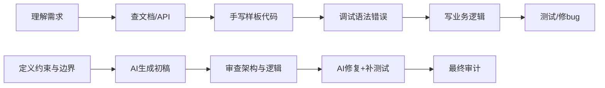
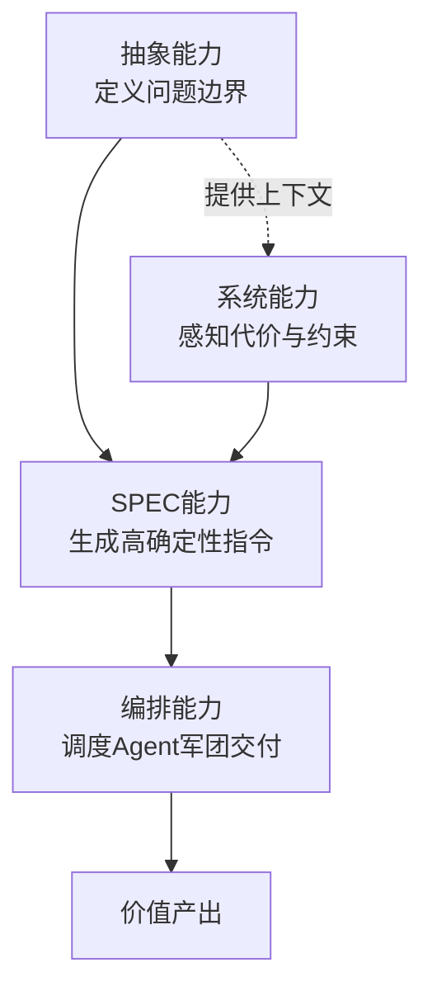

# 手握AI杠杆：程序员从「写代码」到「造价值」的进化论

> 当AI能写90%的代码，程序员的竞争力不再是写得快，而是审得准、判得对、调度得了。从抽象能力到编排Agent军团，这是一份AI时代的进化路线图。

*写作缘起：假期在家，回顾最近的工作——AI基本100%参与每行代码，但人依然很累。累的不是打字，是决策。于是开始想一个问题：当AI把「写代码」这件事的杠杆拉到极致之后，程序员拼的到底是什么？周末翻了一圈行业动态，结合自己的体感，从现象往本质捋了捋，成了这篇文章。*

2025年，Salesforce CEO Marc Benioff宣布冻结软件工程师招聘，理由是AI让工程师产出提升了30%以上。公司预计2026年在Anthropic模型上投入3亿美元——不是买算力，是买「编码能力」。同年，AWS CEO Matt Garman在裁了3万人之后公开说：「我们招的开发者不比以前少。」亚马逊计划2026年全球招募11000名实习生和初级SDE。他补了一句：「擅长写Java代码片段这件事的价值会越来越低。」

一个在冻，一个在招。矛盾吗？不矛盾。Benioff不是在消灭工程师岗位，他是在消灭「旧版本的工程师」。Garman不是在招传统程序员，他是在招「新版本的Builder」。

问题来了：新旧版本之间的分界线，到底画在哪？

---

## 一、AI杠杆的本质：不是锤子，是外接大脑皮层

如果只把AI定义为「写代码更快」，那是对程序员最大的浪费。

我身边用AI的工程师分两种。一种把它当自动补全Plus，代码产出涨了30%，但干的还是原来的活。另一种用它当认知执行器——把脑力决策直接编译成物理世界产出，跳过传统手工的翻译和查表环节。两者的差距不是30%，是10倍起步。

这个杠杆从三个维度起作用。

### 1.1 决策带宽

传统编程，80%的精力花在语法、API调参、样板代码上——这些都是认知带宽的暗物质，不产生价值，但占满你的工作记忆。AI杠杆下，你只需要给架构约束和边界条件，代码骨架、接口定义、测试边界AI来。

你的工作记忆从「怎么写」被解放为「为什么这样写」。一天能处理的架构决策从10个变成100个——撬动的是你能够驾驭的项目复杂度上限。

### 1.2 上下文消化力

人脑装不下整个微服务链路或百万行遗留代码——这不是能力问题，是生物学限制。但AI可以。

把整个仓库、依赖树、错误日志喂给AI，让它做差异影响分析：「改这个底层工具函数，会影响哪些上游模块？有没有潜在的性能回退？」你从盲人摸象的修bug者，变成拿着全景地图的系统架构师。别人踩坑花3天，你靠AI预判花3分钟。

### 1.3 故障预演力

代码写完靠测试找bug？这是被动防御。AI能干一件事叫「混沌式代码审查」——让它扮演恶意攻击者或极端并发场景，对你的逻辑做假设性破坏：「如果这个分布式锁在持有期间节点宕机，会发生什么？给出3种恢复策略。」

你把Debug时间从生产报错后，提前到编译前。别人在处理线上事故，你在设计阶段就消弭了事故。

传统编程 vs AI杠杆编程的流程对比：

上面是传统流程，下面是AI杠杆流程。区别一目了然：传统流程里，人的精力被机械劳动稀释；AI杠杆下，人只做AI做不了的事——下判断。

---

## 二、市场正在分层：你在哪一层？

AI不是在均匀地替代程序员。它在把市场撕成三层。

2026年IT Revolution的一份分析把软件工程市场划成了三个等级。顶层（Apex），$250K-500K+，做系统思维、AI编排、架构判断，需求在暴涨。中层（Hybrid），$150K-300K，工程+产品+设计混合，门槛在快速上移。底层（Automatable），重复编码，被AI和全球远程人才双重挤压，持续萎缩。

国内数据更直观。脉脉2025年报告：传统开发岗位需求同比下降37%，AI应用开发岗位激增215%。1年以内经验的新发岗位量同比减少39.71%。而顶尖院校计算机博士应届生年薪已到300-400万。

这不是「人才过剩」，这是「人才错配」。市场上的程序员没有变多，但市场想要的程序员变了。

值得警惕的不是底层在消失——这个趋势早就有。值得警惕的是**中层正在被压缩**。那些「会用框架、能写业务、但也仅限于此」的工程师，发现AI工具正在以惊人速度吃掉他们的价值区间。不往上走，就会被往下拉。没有第三种选择。

---

## 三、四个核心杠杆能力

如果旧标杆是「能写」，新标杆是什么？我把它拆成四个递进的能力维度。

### 3.1 抽象能力：给AI的无限算力套上引力场

很多人以为抽象就是画架构图、写UML。不是。抽象的本质是「建立约束的优先级」。

AI拥有GitHub上所有代码知识，但它有一个致命盲区——它不知道物理世界的真实重力。老板说「要像抖音一样流畅」，这句话背后是预算有限、只能部署三台4核8G服务器的物理现实。AI不知道这个。它会在真空中生成一个完美的分布式方案，然后在你的机器上根本跑不起来。

所以当你对AI说「目标：日活10万；约束：单机4核8G；边界：支付流程不允许最终一致性」时，你是在做一件AI永远不会做的事——给无限算力套上物理世界的引力场。没有这个引力场，AI生成的架构再完美也是废纸。

EY全球AI负责人Dan Diasio最近点出了一个趋势：数据工程、软件工程、AI工程三个角色正在融合，新员工被预期为「Day One管理者」——第一天就要会分解任务、调度AI。这背后要的第一项能力，就是抽象。

### 3.2 系统能力：代价感知是你的护城河

AI能设计完美的微服务链路。但它不懂人力代价和迁移代价。

你引入一个消息中间件，AI会告诉你「解耦、削峰、性能提升30%」。但它不会告诉你这个中间件未来3年需要多招2个专人维护。它不会告诉你团队目前没有人懂这个技术栈，迁移成本要吃掉两个迭代。它更不会告诉你，当前业务的瓶颈根本不在消息队列上。

**技术债的贴现计算**——把未来的维护成本折现到今天的技术决策里——这是我见过的AI最无能为力的领域。因为这项能力需要的数据，不存在于任何公开仓库里。它存在于你在这个团队干了三年踩过的坑里，存在于你对组织能力的判断里，存在于你对业务增长曲线的预测里。

Microsoft Azure CTO Mark Russinovich和Scott Hanselman在ACM发了一篇文章，区分了两个经常被混淆的概念：**验证（verification）和确认（validation）**。验证是「系统做对了吗」，可以被自动化。确认是「我们做了对的系统吗」，涉及业务语境、成本约束、用户需求判断——这永远是人的事。

未来的系统设计评审，审的不是「这个方案技术牛不牛」，审的是「这个方案的熵增曲线」。能一眼看穿熵增的人，才是不可替代的人。

### 3.3 SPEC能力：确定性密度是你的新KPI

一个新的软件生产线正在成型：**Spec → Agent → Code**。

在这个链条里，Spec不是PRD，不是需求文档。Spec是精确到Agent不需要「猜测」就能直接生成代码的指令集。每一个验收标准是否原子化、每一个接口边界是否排除了二义性、每一个异常路径是否有明确的处理契约——这些定义了你的「Spec确定性密度」。

如果你的Spec模糊，Agent就会猜。Agent一猜，产出的代码就有「幻觉夹层」——看起来能跑，但藏着AI替你做的不确定假设。这些夹层在Code Review时极难发现，往往到生产环境才爆炸。

Anthropic内部自2025年11月起，据Claude Code创始人Boris Cherny透露，已经没有手写代码了——所有代码由Claude工具链生成。Cherny的说法是：「软件工程师」这个title正在消亡，被「Builder」取代。Builder不写代码，Builder定义问题、设定约束、调度AI、审计产出。

顶级程序员的KPI不再是「千行代码/天」，而是「Spec的确定性密度」。当你写的Spec精确到Agent不需要猜测就能产出可部署的代码时，你实际上已经把编程变成了配置——而你作为「配置者」的价值，取决于你能定义多少边界条件。

### 3.4 编排能力：跨Agent的任务契约设计

前三个能力让你能用好一个Agent。但真正的复杂度爆发，在你需要同时调度几十个Agent、跨几十个仓库的时候。

最大的灾难不是某个Agent写不出代码。最大的灾难是Agent A改了底层库的接口，Agent B在不知情的情况下合入了依赖旧接口的上层业务代码——然后CI全红，谁也定位不到根因，因为每个Agent都认为「我只改了我的部分」。

我管这叫「寂静的冲突」。它不会报错，不会告警，只会在合并的那一刻无声地炸掉依赖拓扑。

这时候你不再是写代码的人。你是构建虚拟依赖拓扑的人。像下棋一样，在分配任务之前就定义Agent之间的契约：

> 「A组改底层库，B组改上层业务。A组输出时必须附带向上兼容的适配补丁。B组集成前必须先跑适配补丁。两组在合入主干前，交叉验证对方的接口变更清单。」

Anthropic的2026年智能体编码趋势报告有一个核心判断：单一智能体将演变为协同团队，人类从写代码的人变成带团队的人。不是比喻意义上的「带团队」，就是字面意义上的——只不过你带的不再是人，是Agent。

这种跨Agent的任务契约设计能力，是我眼下能看到的、未来5年最稀缺的工程能力。

四个能力的关系不是并列的，是递进的：

---

## 四、不同阶段的成长策略

四个能力不会一夜之间长出来。不同阶段的工程师，侧重点完全不同。

### 4.1 初级（0-3年）：别做被跳过的坑

这个阶段最大的陷阱很隐蔽：AI帮你跳过了所有试错，但跳过的坑迟早要填。

CMU软件工程研究所2026年发出一个警告——目前没有任何已知的教学法能在缺乏多年实操经验的情况下培养出高级工程技能。如果你从第一天起就靠AI替你调试、替你定位、替你设计，5年后你会发现你和刚毕业的人用着同样的AI工具，产出差距趋近于零。因为你的所有「增量」都来自AI，而非你自己的判断力。

这不是说不用AI。是说**怎么用**。

Microsoft的Russinovich和Hanselman提了一个Preceptorship模型：高级工程师以3:1到5:1的比例带初级工程师，AI工具被配置为「苏格拉底式辅导」——不直接给答案，而是追问、质疑、引导你思考。你有这个条件最好，没有的话就自己做自己的苏格拉底：每次AI给出方案，逼自己回答「为什么是这个方案而不是别的」、「有哪些前提假设」、「如果并发量翻10倍会怎样」。

Egnyte是一家$1.5B的企业云公司，CTO Amrit Jassal坚持招初级工程师并让他们用Claude Code。他的逻辑是：「今天的初级就是明天的高级。AI不是用来替代他们的，是用来压缩学习曲线的。」这句话值得所有初级程序员和管理者三思。

还有一件事：死磕CS基础——数据结构、复杂度分析、内存模型、并发原语。这些东西AI不能替你理解，而你未来所有的高级判断力都长在这些根据地上面。地基不牢，盖不了楼。

### 4.2 中级（3-7年）：从写代码到审代码

这个阶段的工程师，AI对你的价值最大，威胁也最大。

价值最大，是因为你已经有了足够的技术判断力，能一眼看穿AI生成的冗余循环或隐晦竞态。AI做初稿，你做逻辑熔断——这个组合的效率远超纯手写或纯AI。

威胁最大，是因为如果你停留在「写代码快」这个价值维度，AI正在以肉眼可见的速度追平甚至超过你。中级工程师被替代的恐慌不是空穴来风——如果你除了写代码快之外没有其他价值锚点，恐慌是合理的。

怎么破？三件事。

第一，把工作流系统化为「AI初稿 + 人审终稿」。代码由AI生成，但架构决策、技术选型、异常路径处理由你做。你的身份从Producer变成Reviewer，价值衡量从「写了多少」变成「审出了什么」。

第二，用AI做跨域加速器。你是后端，突然要写前端UI、写运维脚本、写合规策略？以前啃书一周，现在AI当即时导师。你的能力边界不再受限于过往经验，而是受限于你的提问精度。一个高级程序员的AI杠杆，等于同时雇了10个不同领域的初级专家为你打下手。

第三，开始沉淀个人SPEC库。把你做过的项目的边界条件、约束、验收标准写下来。每一次和AI的对话当作版本管理——要求AI输出变更清单，改了哪些文件、影响哪些接口。掌控全局的永远是你，不是AI。

### 4.3 高级（7年+）：成为AI军团指挥官

到这个阶段，你的竞争力完全不在代码产出上。你的竞争力在于三件事：**判断什么值得做、设计怎么做的边界、调度谁来做**。

第一是沙盘推演力。当你需要同时推进5个特性、跨3个仓库、调度十几个Agent时，先画依赖拓扑，再定义Agent间契约——接口边界、向上兼容要求、交叉验证流程。你不再是干活的，你是排兵布阵的。干得好，一个Sprint的产出顶一个传统小团队。

第二是做Spec Producer。定义需求、边界、接口、验收标准、架构约束——这些事的价值会越来越高。因为Agent越强，确定性指令就越稀缺。未来最强的程序员未必是写代码最快的人，而是能把模糊业务问题转化为高质量Spec、再指挥Agent军团跨仓库交付的人。

第三是培养技术债贴现的判断力。一眼看出技术方案的熵增曲线——这个能力本质是「代价感知 × 业务理解 × 工程直觉」。AI永远无法从训练数据里学到你的组织在哪个环节最容易出问题、哪个团队的交付能力最强、哪个技术债务已经累积到了临界点。

---

## 五、反面案例：五种加速被替代的做法

正面说完，必须照镜子。以下五种做法，每多一条，你在AI时代的保质期就短一截。

### 5.1 拿来就用：把AI当成品工厂

AI生成的代码看都不看直接合入。出了问题「AI写的，不关我事」。

Code Review权是你最后的防线——连这个都交出去，你的存在价值是什么？AI最不擅长的事恰恰是自我纠错。你能一眼看穿的冗余循环、隐晦竞态，AI自己永远看不出来。你把AI当成品工厂，你的同事和老板就会把你当冗余环节。逻辑很公平。

### 5.2 跳过基础：把AI当学习替代品

从不深究「为什么」。复杂度分析不会，内存模型不懂，并发原理想当然——反正AI懂。

前面说了，CMU已经警告过：跳过的坑迟早要填。而且不是线性补偿，是利滚利——因为高级判断力长在基础的土壤上。5年后你发现，一个刚毕业的人和你用同样的AI工具，产出差距趋近于零。你的工资比他高3倍。你觉得公司会留谁？

### 5.3 拒绝改变：以「AI质量不行」为借口原地踏步

「AI写的代码太烂，我还是手写。」然后继续用2023年的工作方式干2026年的活。

这不是工匠精神，这是效率自杀。Google 75%的新代码已经是AI生成的，Meta要求65%的工程师用AI产出超过75%的代码——这些不是因为他们放弃了质量，而是因为他们把人的精力从「写」挪到了「审」。你坚持手写每一行，你的同行用AI产出初稿然后把省下的时间全投入在审查和架构上。谁的质量更好？

你不是被AI淘汰的。你是被会用AI的同行淘汰的。

### 5.4 孤岛高手：只用AI加速个人产出

AI加持下疯狂输出代码，但不管团队规范、不关注系统全局、不沟通依赖。

AI让代码产出指数级增长，但人类的审查注意力是线性的。当每个人都用AI疯狂产出时，系统最稀缺的不再是产能，是协调力。孤岛式高产只会让系统熵增速度超过团队消化速度——最后你写的代码最多，项目却因为你的「寂静冲突」不断返工。团队宁可找一个产出更低但更可控的人。

### 5.5 PPT架构师：沉迷完美方案，从不落地

让AI生成精美的架构文档、完美的设计模式对比、无懈可击的技术方案——但从不写代码验证，从不面对真实约束。

AI最擅长生成「看起来很对」的东西，因为它拥有所有已知模式却无需承担任何代价。当你沉迷于这种方案快感，你做的恰恰是AI最擅长的事：生成看起来专业的内容。工程的价值不在纸上，在生产环境里扛过流量、出过事故又修回来的系统上。后者AI替代不了你，前者AI比你做得更快更漂亮。

五种做法的共同病根只有一个：**把AI当成了自己的替代品，而不是放大器。**

---

## 六、不可替代的护城河

绕了一大圈，最后落到三件AI做不了的事上。这是你护城河的底部。

**第一，判断「什么值得做」。** AI能告诉你10种实现方案，但它不知道哪种方案在你的组织、你的预算、你的时间线下是「对」的。这需要业务理解、对人判断、组织敏感度——全是AI盲区。

**第二，承担「做错的代价」。** AI生成代码出了生产事故，半夜爬起来修的是你，背锅的是你，给用户道歉的是你。Accountability是人类的独占领域。所以审代码的永远是你，不是AI。这个责任链不会因为技术进步而消失。

**第三，理解「人为什么要用这个」。** 产品直觉、用户体验判断、把老板的「用户会觉得麻烦」翻译成功能优先级——这些东西不在任何需求文档里，不在任何代码仓库里，只在人对人的理解里。

你会发现这三件事有一个共同点：**它们都和「写代码」无关。** AI时代的悖论就是，越是和代码无关的能力，越决定你作为一个程序员的上限。

---

## 七、行动框架

不讲空话。四个时间尺度，四个具体动作。

- **本周**：挑一个你正在做的任务，全程用AI生成初稿，你只做Code Review。不改AI的代码，只标记「哪里有问题、为什么」。体验一下审稿人的视角——这是你未来最主要的工作姿势。
- **本月**：写一份「高确定性Spec」。找一个你熟悉的小功能，把边界条件、验收标准、异常路径写到不需要AI猜测的程度。然后对比在你写Spec前后，AI产出的代码质量差了多少。差距本身会告诉你确定性密度的价值。
- **本季度**：学一个你不熟悉的相邻领域——后端学前端，前端学运维，运维学安全。全程用AI当导师但不让它写结论，你只让它提问、追问、给参考资料。记录你的提问精度的变化曲线。
- **今年**：从「我写了多少代码」转向「我做了多少决策」。开始写个人决策日志——每周记一笔：这周我做的最重要的一个技术判断是什么？AI帮不了我的部分是什么？它暴露了我什么知识盲区？

---

## 结语：程序员的摩尔定律

回到开头的那个矛盾。

Salesforce冻招，不是不需要人了。是需要不一样的人。Amazon扩招，不是要更多写代码的人。是要更多能定义问题、调度AI、守住质量底线的人。

这两个信号指向同一个结论：**程序员这个职业不会消失。但「程序员」这三个字的含义在重新洗牌。**

> AI给程序员最大的杠杆，不是把写代码的速度提升10倍，而是把一个人能够驾驭的系统复杂度提升100倍甚至1000倍。

我愿把它定义为**程序员的摩尔定律**——以前靠人头应对复杂度，未来你一个人就是一个AI开发军团。你不需要成为写代码最快的人，但你必须成为最擅长给AI立规矩、画边界、定契约的人。

从Coder到Architect，从Architect到Orchestrator，从Orchestrator到AI组织管理者——谁最先完成这个身份转变，谁就是AI时代的高端程序员。

这条路不轻松。但比起担心被AI淘汰，有一条路更有意思：**成为那个AI替不了的人。**

---

*写作本身就是思考。动笔前我以为这篇文章的核心是「程序员要怎么用AI」，写完后发现其实是「程序员要重新定义自己」。AI没有抢走我们的饭碗，但它抢走了我们对「饭碗是什么」的旧定义。重新定义这件事，没有人能替我们做。*

*写完这篇，我最深的体感是：AI时代对程序员最大的慷慨在于，它把我们从「实现者」的体力劳动中解放出来；而它最大的残酷在于，它不会等你准备好才按下加速键。但话说回来——这个职业选的就是和变化共生，不是吗。*

---

## 参考资料

- Salesforce CEO Marc Benioff: freezing engineer hiring, $300M Anthropic spend in 2026
  https://www.moneycontrol.com/technology/from-hiring-freeze-to-300-million-ai-spend-how-salesforce-ceo-marc-benioff-is-reshaping-software-development-article-13922465.html

- AWS CEO Matt Garman: hiring as many developers as ever, 11,000 early-career SDE hires in 2026
  https://hr.economictimes.indiatimes.com/news/industry/after-30000-layoffs-amazon-web-services-ceo-says-jobs-are-not-going-away-we-are-hiring-just-as-many-software-developers-as-we-ever-had-inside-amazon/130715146

- IT Revolution: The Great Developer Divide — How AI Is Reshaping the Software Job Market Into Three Tiers
  https://itrevolution.com/articles/the-great-developer-divide-how-ai-is-reshaping-the-software-job-market-into-three-tiers/

- 脉脉2025年人才报告：AI岗位需求变化与薪资数据
  https://www.tmtpost.com/7829199.html

- Microsoft Mark Russinovich & Scott Hanselman (ACM): Redefining the Software Engineering Profession for AI
  https://cacm.acm.org/opinion/redefining-the-software-engineering-profession-for-ai/

- Anthropic Boris Cherny: "software engineer" title dying, replaced by "Builder"
  https://timesofindia.indiatimes.com/technology/tech-news/anthropics-boris-cherny-claude-code-creator-on-future-of-software-engineering-my-prediction-is-that-there-will-be-100-times-more-of/affcmtoi_articleshow/131536661.cms

- Anthropic 2026 Agentic Coding Trends Report
  https://finance.sina.com.cn/roll/2026-02-12/doc-inhmpcup9994943.shtml

- EY Dan Diasio: data/software/AI engineering roles converging, "Day One managers"
  https://www.businessinsider.com/ey-ai-leader-says-engineering-roles-converging-2026-5

- Egnyte CTO Amrit Jassal: keeps hiring juniors, AI compresses learning curve
  https://venturebeat.com/orchestration/why-egnyte-keeps-hiring-junior-engineers-despite-the-rise-of-ai-coding-tools

- Google 75% of new code AI-generated; Meta mandates 65% engineers generate >75% code via AI
  https://ar5iv.labs.arxiv.org/html/2604.26275

- Bhati (2026) survey: Agentic AI in the Software Development Lifecycle (arXiv 2604.26275)
  https://arxiv.org/abs/2604.26275v1

- CMU/SEI: junior developer pipeline warning
  https://cacm.acm.org/news/the-end-of-the-coder/

- Infosys Nilekani: redeploy AI productivity gains into growth, not job cuts
  https://www.newindianexpress.com/business/2026/May/29/infosys-to-redeploy-ai-productivity-gains-into-growth-not-job-cuts-nilekani

- Claude Code: Anthropic's Code with Claude showed off coding's future
  https://www.technologyreview.com/2026/05/21/1137735/anthropics-code-with-claude-showed-off-codings-future-whether-you-like-it-or-not/
