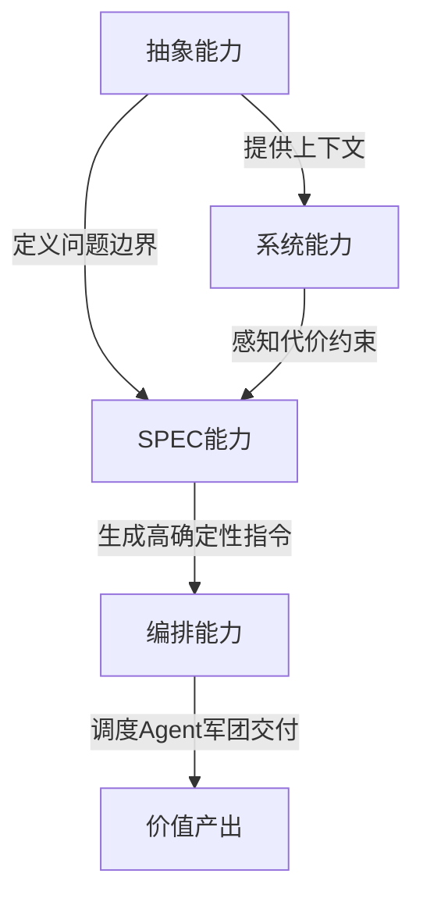

# 写作计划：《AI杠杆之下：程序员从「写代码」到「造价值」的进化论》

> 计划创建日期：2026-06-20
> 状态：待确认

---

## 一、文章定位

- **目标读者**：1-10年经验的程序员，对AI有焦虑也有期待，想找到明确的成长方向
- **核心论点**：AI不是来替代程序员的，而是来重新定义「程序员」这三个字的——从代码生产者变成价值决策者。但前提是，你得主动完成身份转变
- **语气**：第一人称，有判断力，诚实面对不确定性，不讲空话
- **预估字数**：5000-7000字（适合微信公众号深度阅读）

---

## 二、文章结构（共8章 + 开篇钩子 + 结语）

### 开篇钩子：两个矛盾的信号

用一组对比制造张力，让读者感到「这事不简单」：

- Salesforce CEO Marc Benioff 2025年宣布冻结工程师招聘，预计2026年在Anthropic模型上花费3亿美元，称AI让工程师产出提升30%+
- 同一时间，AWS CEO Matt Garman说「我们招的开发者不比以前少」，亚马逊计划2026年全球招11000名实习生和初级SDE。他说：「擅长写Java代码片段这件事的价值会越来越低」

**引出问题**：AI到底是在消灭程序员，还是在重新定义程序员？答案是后者——但「后者的门票」不是白送的。

---

### 第一章：AI杠杆的本质——不是锤子，是外接大脑皮层

**核心素材**：参考材料的4维度杠杆，精简为3个核心维度。

**1.1 决策带宽放大**

传统编程，你80%的精力花在语法、API调参和样板代码上。AI杠杆下，你的代码是「提示词+架构约束」。

- 把你的自然语言架构决策（如「用事件溯源模式处理订单状态，需保证最终一致性」）直接让AI生成骨架、接口定义、甚至单元测试边界
- 你的工作记忆从「如何写」解放为「为何这样写」。一天处理的架构决策从10个变成100个

**1.2 上下文消化力放大**

人脑无法同时装下整个微服务链路或遗留系统的百万行代码，但AI可以。

- 将整个代码库、依赖树、错误日志喂给AI，要求它做「差异影响分析」
- 从盲人摸象的修bug者变成拿着全景地图的系统架构师。别人踩坑花3天，你靠AI预判花3分钟

**1.3 故障预演力放大**

AI能做「混沌式代码审查」——扮演恶意攻击者或极端并发场景，对你的代码逻辑进行假设性破坏。

- 将Debug时间从左移（生产报错后）提前到编译前
- 别人处理线上事故，你在设计阶段就消弭了事故

穿插一个Mermaid图：**传统编程 vs AI杠杆编程的精力分配对比**（机械劳动 vs 创造性判断的比例变化）。

```
传统编程：████████████████ 机械劳动(80%) + ████ 创造性判断(20%)
AI杠杆下：████ 机械劳动(≈0%) + ████████████████ 创造性判断(≈100%)
```

---

### 第二章：市场正在分层——你在哪一层？

**核心数据源**：IT Revolution《The Great Developer Divide》(2026) + 脉脉2025年报告。

**三级市场模型**：

| 层级 | 特征 | 薪资区间 | 趋势 |
|------|------|---------|------|
| 顶层（Apex） | 系统思维 + AI编排 + 架构判断 | $250K-500K+ | 需求暴增 |
| 中层（Hybrid） | 工程+产品+设计混合 | $150K-300K | 门槛上移 |
| 底层（Automatable） | 重复编码，AI+全球人才双重挤压 | 持续萎缩 | 加速消失 |

**国内数据印证**（脉脉2025年报告）：
- 传统开发岗位需求同比下降37%
- AI应用开发岗位需求激增215%
- 1年以内经验的新发岗位量同比减少39.71%
- 顶尖院校计算机博士应届生年薪已达300-400万

**关键洞察**：中间层的消失速度比预期更快。不往上走，就会被往下拉。

---

### 第三章：程序员的新能力模型——四个核心杠杆能力

这是文章的核心章节。基于参考材料的能力框架，融入业界视角。

#### 3.1 抽象能力：给AI的无限算力套上物理世界的引力场

- 不是画UML，而是「建立约束的优先级」
- AI拥有全人类的代码知识，但它不知道老板那句「要像抖音一样流畅」背后是3台4核8G的服务器和有限预算
- 当你说「目标：日活10万；约束：单机4核8G；边界：支付流程不允许最终一致性」时，你是在给AI的无限算力套上物理世界的引力场——没有这个引力场，AI生成的架构再完美也跑不起来
- **业界印证**：EY要求新员工成为「Day One管理者」，本质就是抽象和分解任务的能力；EY全球AI负责人Dan Diasio指出——数据工程、软件工程、AI工程三个角色正在融合

#### 3.2 系统能力：你的护城河是代价感知

- AI能设计出完美的微服务链路，但它不懂人力代价和迁移代价
- 未来的系统设计评审，审的不是「这个方案技术牛不牛」，而是「这个方案的熵增曲线」——你能一眼看出引入这个中间件未来3年需要多招2个专人维护，而AI只看到了性能提升30%
- 这种「技术债的贴现计算」，是AI永远无法从GitHub历史里学到的
- **业界印证**：Microsoft Azure CTO Mark Russinovich和Scott Hanselman在ACM发文警告——验证（系统对不对）可以被自动化，但确认（系统在业务场景下合不合适）永远是人的判断

#### 3.3 SPEC能力：Spec的确定性密度是你的新KPI

- 未来软件生产线：Spec → Agent → Code
- 顶级程序员的KPI不再是「千行代码/天」，而是「Spec的确定性密度」——你写的每一个验收标准（AC）是否原子化？每一个接口边界是否排除了二义性？
- 当你的Spec精确到Agent不需要「猜测」就能生成代码时，你实际上已经把编程变成了配置
- **业界印证**：Anthropic内部自2025年11月起已经没有手写代码；Claude Code创始人Boris Cherny说「软件工程师」这个title正在消亡，被「Builder」取代——一个跨领域思考、调度AI完成交付的人

#### 3.4 编排能力（Orchestrator）：跨Agent的任务契约设计

- 当你指挥几十个Agent跨仓库协作时，最大灾难不是Agent写不出代码，而是Agent A和Agent B发生「寂静的冲突」（比如各自升级了不兼容的依赖）
- 你的角色不再是写代码的人，而是构建虚拟依赖拓扑的人——像下棋一样，在任务分配之前就对Agent说：「A组改底层库，B组改上层业务。A组输出时必须附带向上兼容的适配补丁，B组集成前必须先跑适配补丁」
- 这种「跨Agent的任务契约设计」，才是未来高端程序员真正的金饭碗
- **业界印证**：Anthropic 2026智能体编码趋势报告——单一智能体将演变为协同团队，人类从写代码的人变成带团队的人

四个能力的关系（Mermaid图）：



---

### 第四章：不同阶段的成长策略

#### 4.1 初级程序员（0-3年）：不要做「被跳过的坑」

**最大陷阱**：AI帮你跳过了所有试错，但「跳过的坑迟早要填」。

- **策略一：用AI加速学习，不是替代学习**
  - 让AI用苏格拉底式提问引导你思考，而不是直接给答案（呼应Microsoft的Preceptorship模型——高级工程师以3:1到5:1的比例带初级，AI配置为苏格拉底式辅导而非代码生成）
  - **业界印证**：CMU软件工程研究所警告——目前没有已知的教学法能在没有多年实践的情况下培养出高级技能；人才管道正在断裂
- **策略二：死磕CS基础**
  - 数据结构、复杂度分析、内存管理——这些是AI不会替你「理解」的东西
  - **业界印证**：Egnyte（$1.5B公司）CTO Amrit Jassal坚持招初级工程师并让他们用Claude Code——「今天的初级就是明天的高级」，AI被用来压缩学习曲线，不是替代人头
- **策略三：培养AI不擅长的直觉**
  - 系统设计感、用户体验直觉、并发推理——这些需要时间沉淀的能力

#### 4.2 中级程序员（3-7年）：从「写代码的人」到「AI增强型即战力」

**核心转变**：你的价值不再是写得多快，而是审得多准。

- **策略一：建立「AI初稿 + 人审终稿」的工作流**
  - 代码由AI生成，但逻辑熔断由你把关——一眼看穿AI生成的冗余循环或隐晦的竞态条件
  - 参考材料的视角3：把AI输出当「强力实习生」的产出
- **策略二：培养跨域能力**
  - 后端写前端、写运维脚本、写合规策略——用AI当即时导师（呼应参考材料维度三）
  - 你的能力边界不再受限于过往经验，而是受限于提问精度
- **策略三：开始沉淀个人SPEC库**
  - 把你做过项目的边界条件、约束、验收标准沉淀下来
  - 每一次对话当作版本管理，要求AI输出变更清单（呼应参考材料视角2）

#### 4.3 高级程序员（7年+）：成为「AI军团指挥官」

**核心转变**：从管代码到管Agent。

- **策略一：掌握沙盘推演力**
  - 在任务分配前就定义Agent间契约——依赖拓扑、接口契约、冲突预判
  - 你不再是干活的，你是排兵布阵的
- **策略二：成为「Spec Producer」**
  - 定义需求、边界、接口、验收标准、架构约束——这些价值越来越高
  - 未来最强程序员未必是写代码最快的人，而是能把模糊业务问题转化为高质量Spec、再指挥几十个Agent跨几十个仓库交付的人
- **策略三：培养技术债贴现的判断力**
  - 一眼看出技术方案的「熵增曲线」
  - 这项能力本质是「代价感知 × 业务理解 × 工程直觉」，AI永远无法从训练数据里学到

---

### 第五章：反面案例——五种让你加速被替代的做法

正面策略说完，必须照镜子。以下五种做法，每多一条，你在AI时代的「保质期」就短一截。

#### 5.1 「拿来就用」型：把AI当成品工厂

- **典型行为**：AI生成的代码看都不看直接合入，出了问题只会说「AI写的，不关我事」
- **为什么致命**：你把Code Review的权力让渡给了AI，而AI最不擅长的事情恰恰是自我纠错。你能一眼看穿的冗余循环、隐晦竞态条件，AI自己永远看不出来
- **结局**：短期产出飙升 → 代码质量滑坡 → 线上事故频发 → 团队信任归零。当团队发现「你的代码」其实等于「没审的AI代码」，你的存在价值就没了
- **正确对比**：参考材料视角3——AI是你的强力实习生，不是你的替身。你的核心价值恰恰在「审」不在「写」

#### 5.2 「跳过基础」型：把AI当学习替代品

- **典型行为**：完全依赖AI完成所有技术决策，自己从不深究「为什么」。问复杂度分析不会，问内存模型不懂，问并发原理想当然
- **为什么致命**：CMU软件工程研究所已经警告——没有已知的教学法能在缺乏多年实操经验的情况下培养出高级技能。AI帮你跳过的每一个坑，都会在未来某个关键时刻变成你填不了的天坑
- **结局**：5年后，你发现自己和刚毕业的人用同样的AI工具，产出差距趋近于零——因为你的「增量」全部来自AI，而非自身的判断力积累
- **正确对比**：Egnyte CTO的做法——让初级工程师用AI，但AI用来压缩学习曲线而非替代学习。用苏格拉底式提问引导你思考，而非直接给答案

#### 5.3 「拒绝改变」型：以「AI质量不行」为借口原地踏步

- **典型行为**：「AI写的代码太烂」「我还是手写吧」——然后用2023年的工作方式干2026年的活
- **为什么致命**：这不是在坚持「工匠精神」，而是在拒绝效率和另一种可能性。当你的同行已经实现30%-55%的效率提升时（Google 75%代码AI生成已成基线），你每慢一步，价值被摊薄一分
- **结局**：不是AI淘汰了你，是会用AI的同行淘汰了你。你的手写代码质量再高，抵不过别人一个下午调教Agent交付的完整特性——而且人家同样的时间还能多审两轮
- **正确对比**：不是让你放弃判断力，而是让你把精力从「怎么写」挪到「审什么」。你不拒绝AI，你拒绝的是对AI输出不加判断

#### 5.4 「孤岛高手」型：只用AI加速个人产出，不与系统对齐

- **典型行为**：AI加持下疯狂输出代码，但不考虑团队规范、不关注系统全局、不沟通依赖。变成了「高产的孤岛」
- **为什么致命**：Anthropic趋势报告已经指出——AI时代代码量的增长是指数级的，但人类的审查注意力是线性的。当每个人都用AI疯狂产出时，最稀缺的不再是「产能」而是「协调力」。孤岛式高产只会让系统的熵增速度超过团队的消化速度
- **结局**：你写的代码最多、最快，但项目因为你的「寂静冲突」而不断返工。最后团队宁可找产出更低但更「可控」的人
- **正确对比**：第四章的编排能力——未来最值钱的不是能写多少，而是能协调多少

#### 5.5 「PPT架构师」型：沉迷让AI生成完美方案，从不落地

- **典型行为**：让AI生成精美的架构文档、完美的设计模式对比、无懈可击的技术方案——但从不写代码验证，从不面对真实约束，从不对生产环境负责
- **为什么致命**：AI最擅长生成「看起来完美的纸上方案」，因为它拥有所有已知模式却无需承担任何代价。当你沉迷于这种「方案快感」，你就变成了AI时代最容易被替代的人——因为你做的正是AI最擅长的事：生成看起来专业的内容
- **结局**：你的产出全是「看起来很好」的文档，没有一个是跑在生产环境里、扛过流量、出过事故又修回来的——而后者才是真正的工程价值
- **正确对比**：第三章3.1的抽象能力——抽象的目的是给AI套上现实的引力场，不是为了逃避现实

> **一句话总结**：AI时代被淘汰的，不是「用AI的人」，也不是「不用AI的人」，而是**既不理解AI的边界、也不理解自己独特价值的人**。这五种做法的共同病根，就是把AI当成了自己的替代品而非放大器。

---

### 第六章：不可替代的护城河——三件事AI做不了

1. **判断「什么值得做」**
   - AI能告诉你10种实现方案，但它不知道哪种方案在你的组织、你的预算、你的时间线下是「对」的
   - 这需要业务理解、组织政治敏感度、对人的判断——全是AI盲区
2. **承担「做错的代价」**
   - AI生成的代码出了生产事故，背锅的是你。所以审代码的不是AI，是你
   - Accountability是人类的独占领域
3. **理解「人为什么要用这个」**
   - 产品直觉、用户体验判断、与业务方的「翻译」能力
   - 需求不是写在PRD里的，需求是藏在老板那句「用户会觉得麻烦」里的

---

### 第七章：一个具体行动框架

给读者一份可操作的checklist（不讲空话）：

- **本周**：挑一个正在做的任务，用AI生成初稿，你只做Code Review，体验「审稿人」角色
- **本月**：写第一份「高确定性Spec」——精确到Agent不需要猜测就能执行。对比AI在你写Spec前后产出的代码质量差异
- **本季度**：学一个你不熟悉的领域（前端/运维/安全），全程用AI当导师，记录提问质量的变化
- **今年**：从「我写了多少代码」转向「我做了多少决策」。开始建立个人决策日志——今天我做的最重要的一个技术判断是什么？AI帮不了我的部分是什么？

---

### 结语：程序员的摩尔定律

> AI给程序员最大的杠杆，不是把「写代码的速度」提升10倍，而是把「一个人能够驾驭的系统复杂度」提升100倍甚至1000倍。我愿把它定义为「程序员的摩尔定律」——以前我们靠人头来应对复杂度，未来你一个人就是一个AI开发军团。

回扣开头的Salesforce vs Amazon的矛盾：那些冻结招聘的公司，不是不需要人了，而是需要「不一样的人」。谁能最先完成从 **Coder → Architect → Orchestrator → AI组织管理者** 的身份转变，谁就是AI时代的高端程序员。

---

## 三、参考素材索引

| 来源 | 核心观点 | 对应章节 |
|------|---------|---------|
| 参考材料《AI给程序员带来的杠杆能力》 | 4维度杠杆 + 3个底层视角 + 高端程序员该学什么 | 第一章、第三章、第四章 |
| Salesforce冻结招聘 + $300M投Anthropic | AI重新定义工程师角色 | 开篇钩子 |
| AWS CEO「招人没少」+ 11,000初级岗计划 | 需求转向，不是需求消失 | 开篇钩子、第四章4.1 |
| IT Revolution《The Great Developer Divide》(2026) | 三级市场分化 | 第二章 |
| 脉脉2025年人才报告 | 国内岗位需求结构变化 | 第二章 |
| Microsoft Russinovich & Hanselman (ACM 2026) | Preceptorship模型 + 人才管道危机 | 第三章3.2、第四章4.1 |
| Anthropic Boris Cherny「Builder」理念 | 软件工程师title消亡 | 第三章3.3 |
| Anthropic 2026智能体编码趋势报告 | 单智能体→协同团队 | 第三章3.4 |
| EY Dan Diasio「Day One管理者」 | 角色融合 + 跨界预期 | 第三章3.1 |
| Egnyte坚持招初级 + CTO态度 | AI压缩学习曲线 | 第四章4.1 |
| Google 75%代码AI生成 / Meta 65%要求 | AI编码已成为行业基线 | 第三章引言 |
| CMU/SEI人才管道警告 | 跳过的坑迟早要填 | 第四章4.1、第五章5.2 |
| Goldman Sachs (May 2026) AI成本分析 | AI成本可能追平人力 | 留给正文讨论空间 |
| Bhati (2026) 智能体编码综述 (arXiv 2604.26275) | SWE-bench从1.96%到78.4% | 数据支撑 |

---

## 四、已确认标题

**《AI杠杆之下：程序员从「写代码」到「造价值」的进化论》**

---

## 五、待讨论事项

- [x] 标题选择 —— 已确认，不变
- [x] 反面案例章节 —— 已新增第五章
- [ ] 第四章「不同阶段的成长策略」是否按0-3/3-7/7+分段，还是换一种切法？
- [ ] 第六章「不可替代的护城河」目前列了3条，是否需要扩展或压缩？
- [ ] 第七章行动框架是否需要更细化（比如按「前端/后端/全栈」分别给出建议）？
- [ ] 文章总字数目标：5000-7000字是否合适？
