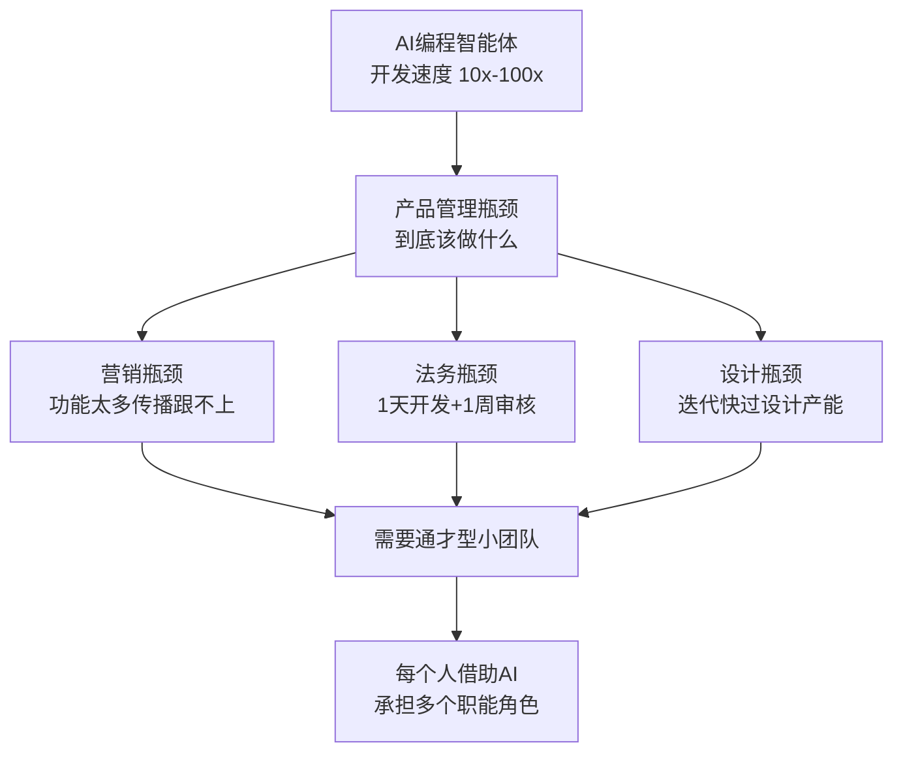

# 写作计划：《当写代码变快100倍：吴恩达Interrupt对谈的5个反直觉判断》

> 计划创建日期：2026-06-21
> 状态：待确认
> 素材来源：[吴恩达LangChain智能体大会对谈](https://mp.weixin.qq.com/s/dpf8fQlJClt7HS6oU-LL5g)
> 本地笔记：`ai-study-note/2026-06-21-吴恩达LangChain智能体大会.md`

---

## 一、文章定位

- **目标读者**：3-8年经验的程序员，已经开始在日常工作中使用AI工具，但对「AI之后自己往哪走」有真实的困惑
- **核心论点**：吴恩达这场对话最大的价值不是技术预言，而是戳破了几个AI叙事中的流行幻觉——代码加速不是终点，它只是把更根本的问题暴露了出来。对个人而言，问题从「怎么写得快」变成了「怎么判断什么值得写」
- **差异化**：市面上大部分AI解读是「信息搬运」，把吴恩达说的话复述一遍。这篇文章要做的是「从对话中提取反直觉判断」，然后用这些判断往回照——照到普通人、照到5年经验的人身上
- **语气**：第一人称，有判断力，诚实面对不确定性，不讲空话
- **预估字数**：5000-7000字

---

## 二、文章结构（共5章 + 结语）

### 第一章：大会核心速写（约1000字）

**目标**：直接进入主题，用反差建立阅读动力——一个AI领域最权威的人，在一个技术大会上，反复强调非技术问题。

**写法**：不是逐条复述，而是抓住几条主线。开篇抛出核心矛盾：LangChain的Interrupt大会，台上坐的是吴恩达和Harrison Chase，按理说最该聊的是模型能力、Agent架构、技术路线。但整场对话里，吴恩达聊得最多的不是技术，而是产品管理、市场营销、法律合规、数据架构、供应商合同——这不是跑题，这是在指路。

1. **编程智能体正在快速进步**——吴恩达6个月前只用Claude Code，现在混用OpenAI Codex、Gemini CLI、OpenCode，切换频率说明竞争在加速
2. **瓶颈正在转移**——从「写不完」变成「想不清楚该写什么」，从工程瓶颈变成产品管理瓶颈，再变成营销/法务/设计瓶颈
3. **团队形态在变化**——1-10人通才型小团队，每个人借助AI承担多个职能
4. **企业落地的真正障碍**——不是模型不够强，是数据架构没准备好、流程没被重构
5. **面对不确定性的姿态**——不签超过一年的合同，保留选择权，不押注单一供应商

本章结尾留一个钩子：以上是「他说了什么」，下面才是「这些话意味着什么」。

---

### 第二章：5个反直觉判断（本文核心，约2500字）

**目标**：不满足于「吴恩达说了X」，而是追问「为什么X是对的，为什么大多数人之前不这么想」。

#### 2.1 「所有环节都会变成瓶颈」——不只是产品管理

- **常见叙事**：AI让开发变快 → 产品经理不够用 → 产品管理是瓶颈
- **吴恩达的升级版**：不只产品管理，营销、法务、设计、合规——所有环节全变成瓶颈。因为你一天能做出产品，但法务还是要等一周签字。以前3个月开发+1周法务能忍，现在1天开发+1周法务，法务就是系统性阻塞
- **反直觉在哪**：我们习惯把「加速」当好事，但加速一个环节会把其他环节的慢速暴露为瓶颈。系统优化的问题从来不是「最快的那个能多快」，而是「最慢的那个什么时候被看见」
- **个人映射**：一个工程师的成长同理——你代码写得再快，如果需求理解偏了、沟通成本没降、部署流程没自动化，你的个人产出天花板不在键盘上，在上下游

#### 2.2 「鸽巢原理」小团队——AI没有让你变成超人，只是让你没那么差

- **常见叙事**：AI让一个人能干五个人的活 → 超级个体崛起
- **吴恩达的修正版**：不是「一个人干五个人的活」，而是「两个人覆盖五种职能，每个人必须承担不止一个角色」。他用「鸽巢原理」来描述——不是你能变成营销专家，而是「用了AI之后，我仍然不是一个好营销人员，只是比没有AI时稍微没那么差」
- **反直觉在哪**：AI的赋能是「缩小你不擅长领域的下限」，不是「拔高你的上限」。这跟大多数AI营销话术完全相反——他们说的是「AI让你变成超人」，吴恩达说的是「AI让你这个外行能产出一个够用的初稿」
- **个人映射**：「够用的初稿」这个定位非常诚实也非常实用。工程师不需要变成法务专家，但能产出一版服务条款初稿，让律师只做最终审阅——这就把法务的1周等待拆成「AI初稿+1天审阅」

#### 2.3 乐高积木的指数效应——不是「多学一个工具」，是「多一块积木，组合数翻倍」

- **常见叙事**：T型人才——一专多能
- **吴恩达的升级版**：不是「多一个技能」，而是积木种类增加时，可搭建的东西呈组合式增长甚至指数增长。一块白色积木能搭的东西有限，加上黑黄棕绿和异形积木后，可能性爆炸
- **反直觉在哪**：不是每个新工具单独值多少钱，而是它和其他工具的**组合数**值钱。RAG + Agent框架 + 评估工具 + Guardrails——单独每块都一般，组合起来能做的东西远超想象。这意味着你学新工具时的ROI不是线性的，是组合式的
- **个人映射**：不要问「学这个有什么用」，要问「学了这个能和我已有的哪些积木组合」

#### 2.4 「渐进式收益比转型式收益更难推动」——2%比50%难

- **常见叙事**：大变革风险大，渐进式稳妥
- **吴恩达的翻转**：告诉某人明年把业务提升2%，他可能觉得「老板就是让我多努力2%」——不会激发真正的创造力。但找50%的增长不可能靠每个人多努力50%，**必须提出更有创造力的解决方案**
- **反直觉在哪**：小目标容易让人偷懒（多干一点就行），大目标反而逼出创新。这对个人的启示是——不要给自己定「每天多用AI写10%代码」这种渐进目标，要定「用AI做一个你一个人原本根本做不出来的东西」
- **个人映射**：这对职业规划同样适用。「明年涨薪10%」是渐进思维，「用AI的工具链让我的产出模式发生结构性变化」是转型思维

#### 2.5 「不知道」的力量——承认不确定性是这个领域最高级的诚实

- **常见叙事**：专家告诉你AI的未来是什么样
- **吴恩达的姿态**：「我不知道一年后领先的AI模型会是什么」「我不认为自己已经知道答案」「我希望我知道如何衡量ROI」
- **反直觉在哪**：在一个所有人都在做预测的领域，最权威的人反复说「我不知道」。但这不是示弱——正是因为他承认不知道，才推导出「不要签超过一年的合同」「保留选择权」这些非常具体的行动准则
- **个人映射**：不需要对未来有确定性的判断，你只需要确保自己**无论哪种未来发生，都有选择权**

---

### 第三章：我们能从中学到什么（约1500字）

**目标**：从「吴恩达说了什么」和「这些判断意味着什么」中，提炼出可迁移到普通人日常的认知框架。这一章不是给CEO的，是给「一个工作日写代码、周末刷推、偶尔焦虑自己会不会被替代」的人——也就是我们自己。

#### 3.1 把AI定位为「下限提升器」而非「上限突破器」

- 不要幻想AI让你变成你本来不是的人。它让你在你本来就弱的事情上「不那么差」，在你本来就强的事情上「更快」
- 具体动作：找出你工作中最常被阻塞的3个非核心环节（比如写周报、做PPT、理接口文档），用AI把它们从「阻塞1天」变成「10分钟初稿」

#### 3.2 建立自己的「积木清单」

- 不是学完，是知道存在。每周花30分钟了解一个新工具/新API/新框架，不用深入，但要知道「它能干什么、和什么配合、解决什么问题」
- 具体动作：维护一个个人笔记/列表，记录你遇到过的构建模块和它们之间的组合关系

#### 3.3 练习「定义问题」而不是「解决给定问题」

- 给定需求→实现功能→交付，这个链条的价值正在下降。提出「我们到底该不该做这个功能」「有没有更根本的解法」的能力正在升值
- 具体动作：下次接到需求时，先花10分钟写一段「如果不做这个功能，有没有其他方式满足同样的用户诉求」

#### 3.4 保留选择权

- 技术栈、工具链、学习方向——不要All-in任何一个。吴恩达自己同时用4个编程智能体
- 具体动作：每隔3个月审视一次「我现在的技能和工作流，如果XX工具明天消失了，我多久能切换」

---

### 第四章：给工作5年程序员的具体建议（约1200字）

**目标**：这一章是写给自己的，所以不写成「建议清单」式的说教，而是写成「如果我能对5年前的自己说几句话」的第一人称反思。

#### 4.1 你的5年经验是最稀缺的「上下文」

- AI能写代码但不知道你公司的客户为什么流失、上次重构踩了什么坑、业务里哪些环节是真正的痛点
- 这些上下文在AI时代不是贬值，是升值——因为它们无法从GitHub上学到
- **可以做的**：有意识地把你的隐性业务知识「外化」——写成文档、梳理成决策树、沉淀为团队共识。这既是对团队的贡献，也是让你自己更清楚「我到底知道什么AI不知道的事」

#### 4.2 从「全栈工程师」走向「全链路工程师」

- 5年前的全栈=前端+后端+数据库。现在「全栈」不够了——你要能借助AI触及产品定义、用户研究、营销文案、数据分析、法务初稿
- 不是让你变专家，是让你变「能产出够用初稿的人」
- **可以做的**：选一个你目前最依赖别人的非技术领域（最常阻塞你的那个），试着用AI辅助产出一次——比如用AI帮你写一版产品说明、分析一份用户反馈、起草一封客户邮件

#### 4.3 积累自己的「乐高工具箱」

- 5年经验意味着你已经有了编程语言的积木、框架的积木、业务领域的积木。现在需要加上AI的积木：RAG、Agent编排、评估工具、可观测性
- **可以做的**：每个月深入了解一个AI构建模块。不是看文档，是用它做一个小项目。年底你就有12块新积木，它们的组合价值远超12块孤立的积木

#### 4.4 学会做「系统级思考」

- 5年经验是从「执行层」往「设计层」走的自然节点。AI加速了这个过程——因为AI能帮你做执行，你被迫要往上游走
- 吴恩达说的「10分钟获批贷款」vs「把人工审批换成AI审批」——两者的差距就是系统思维和执行思维的差距
- **可以做的**：下次做需求时，不只考虑「这个功能怎么实现」，画一张图把上下游环节标出来——这个功能改了以后，对运营、客服、市场、数据各有什么影响

#### 4.5 保留选择权，不要把自己绑死

- 技术上不要绑定单一供应商——个人也是这样。不要让「我是XX框架专家」变成「我只会XX框架」
- **可以做的**：盘点一下你现在的工作流，哪些环节被单一工具/平台深度绑定？有没有替代方案值得了解一下？不一定要切换，但要保持「能切换」的能力

---

### 第五章：结语——真正的稀缺品（约500字）

**核心观点**：当写代码不再稀缺，真正稀缺的是三样东西：

1. **判断力**——知道什么值得做
2. **上下文**——你对业务的理解深度
3. **选择权**——你能在多个方案之间自由切换的能力

这三样东西不是AI能给你的，也不是AI能拿走的。它们是你5年来每天早上坐到工位前积累的东西，只是以前被「写代码」这件看起来很忙的事遮住了。

结尾：不煽情，不喊口号。就一句话落点——**代码加速不是终点，它只是帮我们更快地到达那个真正需要人的判断、经验和权衡的深水区。**

---

## 三、写作注意事项

### 中英文空格（强制）

- ❌ `AI 编程` → ✅ `AI编程`
- ❌ `LangChain 大会` → ✅ `LangChain大会`
- 两个英文单词之间空格保留：`Claude Code`、`Context Hub`
- 章节编号与中文标题间保留空格：`### 2.3 乐高积木的指数效应`

### 引用规范

- 吴恩达的表述尽量使用原文中的直接引语（已标注在笔记中），不要自己改写
- 引语后跟上自己的分析和落点——不要让引语悬空

### 语气控制

- 不写「你应该」——写「我的体感是」「可以做的」
- 每个反直觉判断后面都跟「个人映射」——让观点落到读者（和自己）身上
- 诚实标注「我不知道」的地方——比如AI对就业市场的长期影响

### Mermaid图表

考虑在第二章插入一张图，展示「开发加速→各环节瓶颈暴露」的传导链：

### 参考/联动

- 可联动已有文章《手握AI杠杆：程序员从「写代码」到「造价值」的进化论》中「决策带宽」的概念
- 可联动已有笔记 `2026-06-21-OKF-study.md` 中关于数据基础设施的内容（如适用）

---

## 四、写作节奏

| 阶段 | 内容 | 预计时间 |
|------|------|----------|
| 第一天 | 第一章（大会速写） | 1h |
| 第二天 | 第二章（5个反直觉判断） | 2h |
| 第三天 | 第三章（我们能从中学到什么）+ 第四章（5年程序员建议） | 1.5h |
| 第四天 | 结语 + 全文打磨 + 中英文空格检查 | 1h |

---

*这个计划的重点在第二章——5个反直觉判断是整篇文章的骨架。如果能把每个判断都讲透（为什么反直觉 + 为什么它对 + 对我意味着什么），文章就有根了。第一章不做噱头，直接进入大会现场，用「一个AI权威在技术大会上反复讲非技术问题」这个反差作为全文的入口。*
