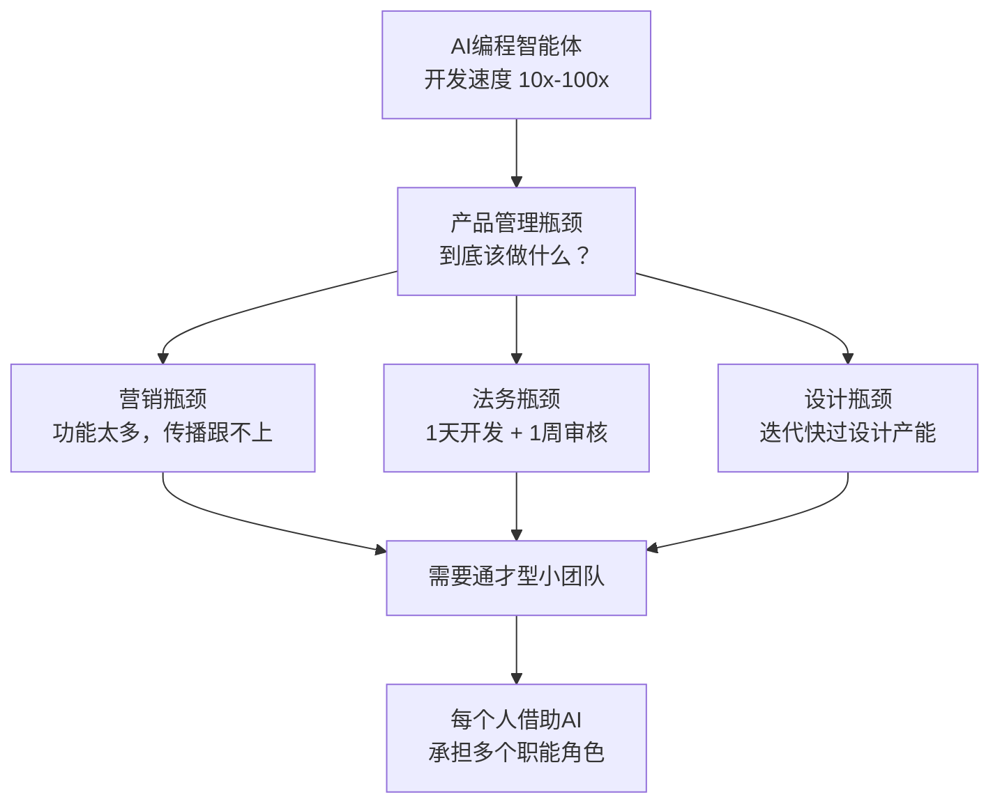

# 当写代码变快100倍：吴恩达Interrupt对谈的5个反直觉判断

> 近期在LangChain举办的智能体大会Interrupt上，吴恩达与Harrison Chase进行了一场对谈。整场交流的核心不是「Agent有多强」，而是一个更现实的问题：当AI Agent让软件开发变快之后，真正的瓶颈会转移到哪里？本文不是会议纪要，而是从对话中提取5个反直觉判断，往回照到我们自己身上。

---

## 一、大会核心速写

LangChain的Interrupt大会，台上两个人：吴恩达和主办方创始人Harrison Chase。按常理，一个AI技术大会上，最该聊的是模型能力、Agent架构、技术路线。但细读整场对话，会发现吴恩达聊得最多的不是技术。

一个AI领域最权威的人，在一个技术大会上，全程聊的不是模型参数，而是产品管理、市场营销、法律合规、数据架构、供应商合同的年限——这不是跑题，这是在指路。

整场对话有六条主线：

**第一，编程智能体正在快速进步。** 吴恩达说六个月前他几乎只用Claude Code，现在混用OpenAI Codex、Gemini CLI、OpenCode。他甚至在手机上写代码——一年前他不会想到这个。他的措辞是：「编程智能体的前沿能力变化非常快，而且竞争非常激烈。」

**第二，瓶颈正在转移。** 这是整场对话最重要的一句话：「产品管理瓶颈以一种好的方式变得更严重了。」当代码实现速度提升10倍甚至100倍后，限制团队效率的就不再是「能不能做出来」，而是「到底该做什么」。而且不止产品管理——营销、法务、设计、合规，全部变成了新瓶颈。

**第三，团队形态在变化。** 吴恩达越来越多地组建1到10人的小团队，成员是「高上下文、高授权、技术能力强的通才型工程师」。他们不只写代码，还会借助AI完成产品定义、营销文案、服务条款初稿。核心逻辑是「鸽巢原理」——两个人和五种职能，每个人必须承担不止一个角色。

**第四，企业AI落地的真正障碍不是模型。** 很多企业做「自下而上」的AI创新，搞百花齐放，但只能带来点状提效。真正的大机会是重构整个业务流程——不是把人工贷款审批换成AI审批，而是推出「10分钟获批」的全新产品。此外，吴恩达特别强调数据架构——非结构化数据（文本、PDF、图片、音频、视频）的治理和重组，是Agent产生价值的真正地基。

**第五，面对不确定性的姿态。** 「我不知道一年后领先的AI模型会是什么。」基于这个认知，吴恩达说无论多大折扣，他几乎从不签超过一年的合同。保留选择权，比省几个点的成本重要得多。他也明确支持开放权重模型，认为它们「让世界更丰富」。

**第六，前线部署工程师（FDE）正在崛起。** FDE的本质是技术与商业价值之间的翻译官和落地负责人——用吴恩达的话说，构建智能体工作流本身就很难：需要理解业务、面向客户、做好可观测性和评估、判断哪些需求在技术上不可行、帮企业管理变革。这些问题不是模型能解决的。吴恩达认为大多数企业会需要内部工程师+一小支FDE的组合，但他也提醒，围绕这个角色的炒作可能比现实略高。

值得停下来想一想的是，吴恩达说构建智能体工作流「很难」——这不是谦虚。如果你看业界实践，Datadog的2026年AI工程报告显示，约5%的AI模型请求在生产中失败，其中60%是容量限制而非模型质量问题。每步95%准确率的Agent，跑10步后成功率只剩约60%。国内数字人赛道看似热闹——硅基智能营收增长但连续亏损，客户数从1009家锐减到431家，说明企业买回去之后真正用起来的很少。Google的Project Mariner、OpenAI的Operator、Claude Code，各自都还在迭代Agent的可靠性。一个共识正在浮现：Agent能落地的，目前都是窄场景、明确边界、人机协同的模式，全自主Agent替代整个工作流的愿景还没兑现。

对话中还有一个容易被忽略的话题——AI如何改变教育。吴恩达的态度很诚实：「我们思考『如何学习会被改变』已经很久了，但感觉真正的变化其实还没有完全到来。」他展示了CodeDream.ai，一个实验性的教育产品，核心理念是把在线课程变成一场对话——不是看视频，而是和一个AI驱动的「吴恩达」进行一对一互动。更关键的设计是，视频区域本身是交互式的：不播预先录好的画面，而是运行JavaScript，你可以直接点击画面、输入自己的查询。用他的话说：「视频区域不是一个只能播放的静态视频，而是可交互的。」这个思路的底色和他整场对话的立场完全一致——真正重要的不是技术本身有多新，而是它有没有改变人和内容之间的关系。

以上就是「他说了什么」和这些判断的现实注脚。下面是「这些话意味着什么」。

---

## 二、5个反直觉判断

### 2.1 不只是产品管理——「所有环节都会变成瓶颈」

关于AI加速开发的影响，市面上常见的叙事是：开发快了 → 产品经理不够用 → 产品管理是瓶颈。这个逻辑是对的，但不够。

吴恩达把这张图补全了。他说，过去一个产品需要法律合规，你花三个月构建它，再等一周让法务签字——可以接受。但现在，产品一天就能构建出来，法务还是要等一周，这一周就不再是「走流程」，而是系统性阻塞。

同样的事发生在营销上。他的团队已经遇到了「营销瓶颈」——因为能构建的功能太多，营销人员反而跟不上：要搞清楚新功能到底做了什么，再思考如何对外传播。设计也会成为瓶颈，其他环节也一样。

**反直觉在哪。** 我们习惯把「加速」当作好事来追求，但加速一个环节只会把其他环节的慢速暴露出来。系统优化不是「让最快的那个再快一点」，而是「什么时候才会看见最慢的那个」。

把这个逻辑往个人身上套，结论是一样的。你代码写得再快，如果需求理解偏了、上线流程卡在运维、做完没人知道怎么用——你的个人产出天花板不在键盘上，在上下游。AI帮你踩油门，但路如果堵了，踩多深都没用。真正限制你效率的，往往是那些你从来不觉得「归我管」的环节。

---

### 2.2 「鸽巢原理」小团队——AI没有让你变成超人

AI圈最流行的一种叙事是：AI让一个人能干五个人的活，超级个体崛起。

吴恩达的版本微妙得多。他说的是：假设一个团队需要软件工程、产品管理、服务条款、营销文案、设计——五种职能，但只有两个人。按照「鸽巢原理」，每个人都必须承担不止一个角色。

然后他补了一句非常诚实的话：「我不觉得自己是一个很好的营销人员。但当我使用AI时，我仍然不是一个好营销人员，只是和没有AI助手相比，稍微没那么差。」

**反直觉在哪。** AI的赋能方向不是「拔高你的上限」，而是「缩小你在不擅长领域的下限」。这和大多数AI营销话术完全相反——他们说的是「AI让你变成超人」，吴恩达说的是「AI让你这个外行能产出一个够用的初稿」。

「够用的初稿」这个定位非常诚实，也非常实用。工程师用AI起草一版服务条款，再交给律师做最终润色——你没有变成律师，但你让律师的工作从「从零起草」变成了「最终审阅」。把一周的等待拆成「5分钟AI初稿 + 1天律师审阅」，阻塞就被解开了。

坦率地说，我对这个判断的体感很强。日常工作里，我借助AI最多的场景不是写代码——那是基本功——而是写PRD说明、做竞品调研、起草邮件。我写得没有产品经理好、没有分析师专业、没有商务同事情商高，但AI帮我产出了一个可以改的起点。改比写快十倍，这个道理在你擅长的领域和你完全不懂的领域都成立。

---

### 2.3 乐高积木的指数效应——不是「多一个技能」，是「组合数翻倍」

「T型人才」这个概念说了很多年：一专多能。吴恩达用了一个更精准的比喻——乐高积木。

今天的开发不只是面对模型。前面还有RAG、Agent框架、评估工具、Guardrails、UI组件、身份认证、数据库——大量构建模块。吴恩达的观察是：开发者越了解这些模块，越能快速组合出可用系统。但关键不在于「多知道一个」，而在于积木种类增加时，你能搭建的东西呈组合式增长——甚至指数增长。

「如果我手里只有一块白色乐高积木，我能搭一些东西，但不会太有意思。但如果我再加入黑色、黄色、棕色、绿色的积木，再加上一些形状奇特的乐高零件，那么随着我拥有的积木种类变多，我能搭出的东西会以组合式方式增长。」

**反直觉在哪。** 你学一个新工具，价值不是「+1」，而是「和我已有的N块积木产生了N种新组合」。RAG单独用一般，Agent框架单独用一般，但RAG + Agent + Guardrails + 评估工具组合起来，能做的东西远超想象。这意味着你拓展知识面的ROI不是线性的——早期回报不明显，越过某个临界点后爆发。

同时吴恩达也指出了一个现实问题：工具变得太快，很多模型的知识截止时间甚至赶不上最新API的发布时间。所以他一直关注Context Hub这个项目——让编程智能体能获取最新文档，知道有哪些最新API、SDK和工具可以使用。本质上，Agent的能力不只取决于模型本身，也取决于它能不能获得及时、准确、可执行的上下文。这个判断本身，也是在提醒我们：积木是好东西，但积木的说明书更新得比谁都快，要保持信息敏感。

---

### 2.4 「渐进式收益比转型式收益更难推动」——2%比50%更难

吴恩达在谈企业AI的ROI衡量时，说了一句非常反常识的话：

「有时候，推动渐进式收益反而比推动转型式收益更难。如果你告诉某人，明年把业务结果提升2%，他可能会觉得，好吧，老板就是让我多努力2%或5%。但如果你要寻找能带来20%或50%业务增长的方法，你不可能让全公司每个人都多努力50%。你必须提出更有创造力的解决方案。」

**反直觉在哪。** 小目标是偷懒的借口。2%的提升靠「多干一点」就能敷衍过去，不需要重新思考任何东西。但50%的增长不可能靠加班，必须重新设计流程、重构产品、换一种打法。大目标不是更难实现——是更难敷衍。

这也解释了他之前说的「不要只把AI当降本工具」。降本是2%思维——省一点人力、快一点响应。增长是50%思维——能不能推出一个「10分钟获批」的贷款产品？能不能让客服从成本中心变成增长引擎？

把这个逻辑挪到个人成长上，结论非常清晰：不要给自己定「每天多用AI写10%代码」这种渐进目标。这种目标不会改变任何东西——你还是在做原来的事，只是快了一点。可以做的，是定一个「用AI做一个你一个人原本根本做不出来的东西」的目标。比如一个人开发一个小产品从idea到上线只用一周，或者写一份你以前从来没能力产出的深度分析。这类目标逼你重新思考工作流，而不是加速旧工作流。

---

### 2.5 「不知道」的力量——承认不确定性是这个领域最高级的诚实

这篇文章写到这里，AI圈子里每天都有新的预测、新的路线图、新的「XX已死」的檄文。但整场对话里，吴恩达说了至少三次「我不知道」。

「我不知道一年后领先的AI模型会是什么。」「我不认为自己已经知道答案。」「我希望我知道如何衡量ROI。」

在一个所有人都在做预测的领域，最权威的人反复说「我不知道」。但这不是示弱——恰恰是因为他承认不知道，才推导出了一系列非常具体的行动准则：不要签超过一年的合同、保留选择权、同时维护多个编程智能体的使用能力、支持开放权重模型。

**反直觉在哪。** 我们通常以为确定性才产生行动力——「我知道未来是什么样，所以我这样布局」。但吴恩达的逻辑是反过来的：正因为我不确定，所以**我必须保留在多种未来之间自由选择的能力**。不确定性不是不作为的理由，反而是保持灵活性的理由。

这一点对我的影响比前面几个判断都大。当我不知道明年最强的编程工具是什么的时候，我能做的最聪明的事不是猜对答案，而是确保无论答案是什么，我都能快速切过去。「我只会XX」在任何时代都是风险，「我只会XX」在AI时代是自杀。

---

## 三、我们能从中学到什么

前面写的是分析和判断，这一章要落回到我们自己身上——不是给CEO的建议，是给一个工作日写代码、周末刷推、偶尔焦虑自己会不会被替代的人。

### 3.1 重新定位AI在你工作中的角色

吴恩达说AI让他「在不懂的领域没那么差」——这个定位比任何「AI改变世界」的口号都更有操作价值。

可以做的：找出你日常工作中最常被阻塞的3个非核心环节。不是写代码这种你本来就擅长的事，而是那些你不想做、不擅长做、但不做又会卡住的事——写周报、整理会议纪要、起草给跨部门同事的邮件、做竞品调研PPT。然后试着用AI把每个环节从「拖半天」变成「5分钟出初稿」。不用追求完美，只需要「够用」。

我自己试下来，最大的变化不是时间省了多少，而是**心理摩擦力降了**。以前有些事拖着不做不是因为没时间，是因为一想到要做就烦。现在知道5分钟能搞定初稿，启动门槛低了一大截。

### 3.2 建立自己的「积木清单」

吴恩达的乐高比喻对个人学习策略有直接启示：不要问「学这个有什么用」，要问「学了这块能和哪些已有的积木组合」。

具体做法不复杂：维护一个个人笔记（哪怕就是个markdown文件），每当你遇到一个新工具、新API、新框架，记三行——「它能干什么、它和什么配合、它解决什么问题」。不需要深入掌握，只需要**知道存在**。当某天你遇到一个问题时，你能想起来「好像有个东西能做这个」，然后让AI帮你查最新文档、写调用代码。

这个习惯的复利效应比你想象的大。一个月积3块，一年36块——它们之间的组合数不是36，是大得多的一笔账。

### 3.3 练习「定义问题」而不是「解决给定问题」

给定需求 → 实现功能 → 交付上线，这个链条的价值正在系统性地下降。因为AI在「解决给定问题」这个环节越来越强。但「定义问题」——这个功能到底值不值得做、用户真正的诉求是什么、有没有更根本的解法——这些是AI做不了的。

下次接到需求时，可以先做一个练习：花10分钟写一段——「如果不做这个功能，有没有其他方式满足同样的用户诉求？」或者「做了这个功能之后，对客服、运营、数据团队各有什么影响？」这些问题在以前是产品经理的活，在以后的团队里是每个人的活。

### 3.4 保留你自己的选择权

吴恩达说他不签超过一年的合同。对个人而言，「合同」就是你的技术栈绑定程度。

可以每隔3个月问自己一遍：如果我现在每天用的XX工具明天消失了，我多久能切换到替代方案？如果答案是「完全不知道替代方案是什么」，那就值得花一个下午了解一下。不一定要迁移，但要保持能迁移的能力。

更具体地说：不要让自己变成「XX框架专家」以至于离了XX就不会写代码。你的身份是「能用一切可用工具解决实际问题的人」，不是「用XX的人」。

---

## 四、给工作5年程序员的一些话

这一章的本质是写给我自己的。所以不列「你应该」，列「我在想」。

### 4.1 你的5年经验从来没这么值钱

5年意味着你见过足够的代码、踩过足够的坑、熟悉一两个业务域。这些在以前当然有用，但在AI时代有一个新增的维度——**AI永远拿不到这些上下文**。

AI能把GitHub上所有公开代码都学完，但它不知道你公司那个老系统的第三个模块为什么用了一个奇怪的缓存策略（因为3年前双十一出了一个事故）。它不知道你们客户最烦的不是功能不够，是每次改版之后菜单位置会变。它不知道上次你用事件溯源模式重构订单系统的时候，最大的阻力来自隔壁团队不肯改接口。

这些上下文在AI时代不是贬值，是升值。因为它们无法从任何公开语料中学到。它们是你坐在这张椅子上5年积累的唯一性资产。

可以做的：有意识地把这些隐性知识外化——写成设计文档的背景说明、梳理成架构决策记录、沉淀为新人上手的上下文包。这既是对团队的贡献，也让你自己更清楚地看到：原来我知道这么多AI不知道的事。

### 4.2 从「全栈」走向「全链路」

5年前全栈 = 前端 + 后端 + 数据库。那时候这个定义是够的。现在不同了——因为AI帮你把「写代码」这件事的摩擦力降到了极低，真正卡你产出的，通常是写代码之外的事。

不是让你变成产品经理+设计师+法务+营销，那不可能也没必要。但你可以借助AI，在每一个环节都做到「能产出够用的初稿」。够用就好——你知道产品说明怎么写、用户反馈怎么分析、数据报告怎么出。你不用变成专家，你只需要在2人团队里不被那5种职能卡住。

可以做的：选一个你目前最依赖别人的非技术环节——最常让你等、最常卡住你的那个——然后用AI辅助，独立完成一次。做完之后你会有一个体感：原来这件事没有想象中那么不可触及。

### 4.3 积累你的AI积木，一个月一块

5年经验意味着你已经有了不少技术积木——编程语言、框架、业务领域。现在已经到了该加AI积木的时候了：RAG、Agent编排、评估、可观测性、Guardrails、向量数据库、提示工程的结构化方法。

不用急。每个月深入了解一个，不是看文档，是用它做一个小东西。年底你就有12块新积木，和之前的技术积木组合起来，能做的东西会远超你现在能想象的。

### 4.4 练习系统级思考

5年是从「执行层」往「设计层」走的自然节点。AI把这个进程加速了——因为执行层的很多事AI能接走，你被迫要往上游思考。

吴恩达讲的银行例子是最好的教材：把人工审批换成AI审批 → 点状提效。重新设计整个贷款流程，推出「10分钟获批」→ 系统重构。前者的思考方式是「这个环节怎么优化」，后者的思考方式是「这个系统如果重新设计，最优解是什么」。

下次做需求时，不只考虑「这个功能怎么实现」。画一张图把上下游标出来——这个功能上了之后，运营怎么操作、客服会被问到什么问题、数据报表里什么指标会变、市场同事能用它说什么故事。

这张图比你的代码值钱。

### 4.5 别把自己绑死

框架会过时、工具会换代、今天的行业标准明天可能就没人提了。5年里你一定已经亲眼见过至少一轮技术栈的兴衰。AI只会让这个周期更快。

可以做的：盘点一下你的日常工作流——哪些环节被单一工具深度绑定？这些环节有没有替代方案？不需要迁过去，但值得花一个下午了解「如果明天它没了，我能用什么」。

「我是Claude Code用户」不是身份。「我能用任何工具把事情做成」才是。

---

## 五、结语

整场对话听完，吴恩达在我心里的形象从一个技术权威变成了一个务实的系统思考者。他不预言AGI什么时候来，也不喊「XX已死」的口号。他反复回到一个朴素的问题上：**有了更好的工具之后，什么东西会变贵？**

他的答案是：判断力会变贵。决定做什么的判断力，重新设计流程的判断力，在十几个看似都不错的选项中做出取舍的判断力。

上下文会变贵。你对业务的理解深度、对系统的全局认知、对用户的前置洞察——这些AI从公开数据里学不到的东西，会越来越值钱。

选择权会变贵。在快速变化中保持不绑定的能力，不是消极的观望，而是积极的准备。

这三样东西不是AI能给你的，也不是AI能拿走的。它们是你5年来每天早上坐到工位前积累的东西，只是以前被「写代码」这件看起来很忙的事遮住了。现在AI把那层遮布掀了——下面露出来的，才是你真正的价值底色。

代码加速不是终点。它只是帮我们更快地到达那个真正需要人的判断、经验和权衡的深水区。那里才是该待的地方。

---

*写作本身就是思考。写完这篇文章，我最大的收获是一个重新校准：以前我问的是「AI能帮我做什么」，这是个效率问题。现在我应该问的是「有了AI之后，我的什么能力会变得更稀缺」——这是个生存问题。前者让你跑得快，后者让你朝着对的方向跑。*

---

## 参考文献

- 吴恩达×Harrison Chase对谈完整版（InfoQ编译）：https://mp.weixin.qq.com/s/dpf8fQlJClt7HS6oU-LL5g
- 原视频链接：https://www.youtube.com/watch?v=OaRhpwz_TGM
- CodeDream.ai：https://codedream.ai
- Datadog State of AI Engineering 2026：https://www.datadoghq.com/state-of-ai-engineering
- 吴恩达×Harrison Chase对谈原始笔记（本地）：ai-study-note/2026-06-21-吴恩达LangChain智能体大会.md
